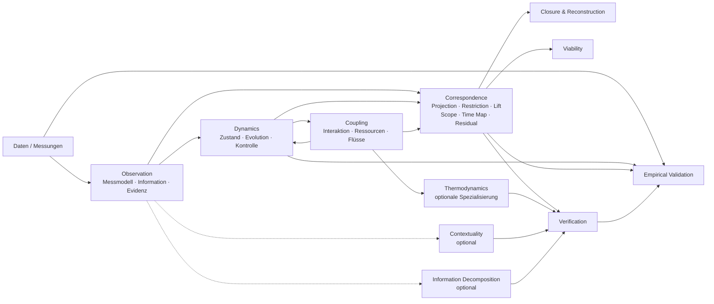
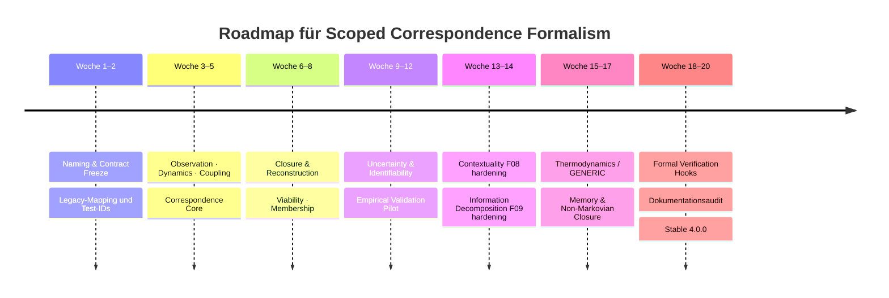

# Namenskonventionen und nächste Erweiterungen für den CREP/UTAC/AFET-Formalismus

## Executive Summary

Der wichtigste Befund dieser Recherche ist konzeptionell ziemlich eindeutig: **Der mathematische und methodische Gehalt von Revision 3.2 ist inzwischen stärker als das Vokabular CREP/UTAC/AFET, das ihn bezeichnet.** Der aktuelle Rahmen behauptet gerade **keine** Identität zwischen Informations-, Dynamik- und Kopplungsgrößen, sondern trennt Beobachtung, Systementwicklung, Kopplung, Transformation, Geltungsbereich und Evidenz explizit voneinander. Die Leitidee ist eine transformationsgebundene, zusammensetzbare und zerlegbare Selbstähnlichkeit; mathematische Selbstähnlichkeit wird nur bei spezifizierter Transformation, Zeitabbildung, Parameterzuordnung, Domäne und Fehlermaß behauptet. Empirische Selbstähnlichkeit erfordert zusätzlich unabhängige Daten und Validierung. fileciteturn3file0 fileciteturn4file0

Daraus folgt meine zentrale Empfehlung:

> **CREP, UTAC und AFET sollten als historische Bezeichnungen erhalten, aber aus der zukünftigen öffentlichen Kernnomenklatur ausrangiert werden.**  
> Der Formalismus selbst sollte nicht aufgegeben, sondern unter einer wissenschaftlich nüchterneren Bezeichnung weiterentwickelt werden.

Als stärkste Gesamtbezeichnung empfehle ich:

**Scoped Correspondence Formalism**

und als URL-/Repository-Bezeichnung:

`scoped-correspondence-formalism`

Ich würde **SCF nicht als primäres Akronym etablieren**. Der ausgeschriebene Name ist präziser und vermeidet erneut den Effekt, dass ein Drei-Buchstaben-Kürzel zu einer ontologischen Marke wird. Das Wort *Scoped* codiert unmittelbar den entscheidenden methodischen Fortschritt von Revision 3.2: Jede Korrespondenz besitzt einen Geltungsbereich. *Correspondence* ist bewusst schwächer als *equivalence*, *identity* oder *universality* und passt damit zum Formalismus: Eine Beziehung zwischen Beschreibungen kann exakt, näherungsweise, projektiv, kontextabhängig oder empirisch widerlegt sein. In der Kategorientheorie ist selbst „Äquivalenz“ bereits ein technisch starker Begriff mit Funktoren und natürlichen Isomorphismen; diese Terminologie sollte daher nur verwendet werden, wenn die entsprechenden Gesetze tatsächlich vorliegen. citeturn12search0turn12search1

Die drei heutigen Kernschichten würde ich entsprechend sehr schlicht benennen:

| Alt | Empfohlener öffentlicher Name | Paket/Namespace | Inhalt |
|---|---|---|---|
| CREP | **Observation** | `observation` | Messung, Information, Repräsentation, Evidenz |
| UTAC | **Dynamics** | `dynamics` | Zustand, Evolution, Störung, Kontrolle, Stabilität |
| AFET | **Coupling** | `coupling` | Wechselwirkung, Fluss, gemeinsame Ressourcen, Kopplung |
| transformationsgebundene Selbstähnlichkeit | **Correspondence** | `correspondence` | Abbildung zwischen Modellen/Ebenen einschließlich Scope und Residuum |
| thermodynamischer AFET-Sonderfall | **Thermodynamics** | `thermo` | Bilanzen, Flüsse, GENERIC usw. |
| F08 | **Contextuality** | `extensions.contextuality` | Sheaf-/Global-Section-Prüfungen |
| F09 | **Information Decomposition** | `extensions.info_decomposition` | PID und Redundancy Bottleneck |
| mathematische Tests | **Verification** | `verification` | Formeln, Verträge, Gegenbeispiele |
| reale Datenprüfung | **Validation** | `validation` | Holdout-Daten, Kalibrierung, Baselines, Unsicherheit |

Diese Terminologie folgt einem sehr stabilen Muster etablierter Mathematik und wissenschaftlicher Software: **Dinge werden nach ihrer operativen Rolle benannt, starke mathematische Wörter werden nur bei erfüllten Gesetzen verwendet, und Algorithmen werden von den Konzepten getrennt.** SciML verwendet beispielsweise `ODEProblem`, `ODEFunction` und Zustands-/Parameterargumente statt einer domänenspezifischen Metatheorie; equation-free multiscale modeling spricht explizit von *lifting* und *restriction* zwischen fein- und grobskaligen Beschreibungen; MOOSE verwendet explizite *Transfer*-Objekte mit Quell- und Zielrollen. citeturn13academia48turn13academia50turn13search13

Auch die in der bereitgestellten Claude-Code-Diskussion formulierte Sorge halte ich nach der Recherche für berechtigt: Die alten Akronyme haben einen semantischen „Gravitationszug“ hin zu einer vermeintlichen gemeinsamen Theorie erzeugt, obwohl Revision 3.2 gerade gelernt hat, Analogie von Identität zu trennen. Ein historischer Schnitt — alte Pakete bleiben reproduzierbar, neue Entwicklung nutzt die neue Nomenklatur — ist wissenschaftlich und softwaretechnisch sinnvoller als ein massenhaftes rückwirkendes Umbenennen des gesamten Ökosystems. fileciteturn0file0

Eine wichtige Präzisierung zum aktuellen Teststand: Die häufig genannte Struktur **19 Basisprüfungen + 16 Ergänzungsprüfungen** beschreibt 35 benannte Prüfungen der älteren Kern-/Erweiterungssuite. Revision 3.2 besitzt zusätzlich **18 Transformations-/Viabilitätsprüfgruppen**, F08 weitere **6/6**, F09 weitere **7/7**. Der jüngste Commit dokumentiert damit **19 + 16 + 18 + 6 + 7 = 66 grüne Prüfgruppen** nach erneutem Gesamtlauf. fileciteturn5file0 fileciteturn6file0 fileciteturn10file0

Für die nächsten fachlichen Schritte sind aus meiner Sicht fünf Erweiterungen besonders wichtig: **Correspondence Contracts**, **Closure & Reconstruction**, **Viability**, **Uncertainty & Identifiability** und vor allem eine **Empirical Validation Pipeline**. F08/F09 sind wertvolle optionale Diagnostik, aber nicht der Engpass für die wissenschaftliche Reife. Der eigentliche nächste Sprung besteht darin, die bereits gute Theorie an eine reproduzierbare Kette aus Daten, Messmodell, Kalibrierung, Holdout-Prüfung, Null-/Baseline-Modellen und Unsicherheitsquantifizierung anzuschließen. Diese Richtung stimmt auch mit der eigenen Roadmap des Repositories überein. fileciteturn9file0

Für Zeit- und Aufwandsangaben nehme ich, wie gewünscht, ein **kleines Team von 2–4 Entwickler:innen** an, darunter mindestens eine Person mit mathematisch-wissenschaftlichem Schwerpunkt. Unter dieser Annahme ist ein sauberer Übergang zu einer ersten stabilen neuen Major-Version in ungefähr **16–20 Wochen** realistisch; Formalisierung in einem Proof Assistant kann parallel beginnen, sollte aber den stabilen Kern-Release nicht blockieren.

## Ist-Architektur und wissenschaftlicher Ausgangspunkt

Revision 3.2 hat aus dem ursprünglichen Akronym-System bereits etwas wesentlich Interessanteres gemacht: einen **mehrschichtigen Beschreibungs- und Prüfrahmen für dynamische Systeme**, in dem Gleichsetzungen zwischen Ebenen ausdrücklich vermieden werden. CREP fragt, welche Information beobachtbar, erhalten oder nutzbar ist; UTAC beschreibt Zustandsentwicklung, Eingaben und Störungen; AFET beschreibt tatsächliche Einwirkungen und besitzt Thermodynamik nur als spezifizierten Sonderfall. fileciteturn3file0 fileciteturn4file0

Die zentrale allgemeine Schreibweise

\[
\dot z_i^{(\ell)}
=
f_i^{(\ell)}
\!\left(
z^{(\ell)},u^{(\ell)},t;
\theta_i^{(\ell)}(z^{(\ell)},u^{(\ell)},t)
\right)
\]

macht dabei bereits deutlich, dass **Ebene, Komponente, Zustand, Eingabe und Parameterkontext Bestandteile der Beschreibung sind**. Zusammensetzen benötigt eine explizite Kompositionsregel; Zerlegen benötigt eine Auflösung und gegebenenfalls zusätzliche Zustände, Liftings oder Gedächtnis. Eine Vergröberung darf Information verlieren und muss deshalb nicht automatisch eine autonome Markov-Dynamik besitzen. fileciteturn4file0

Die mathematische Leitprüfung

\[
T\circ\Phi_j^t
\approx
\Phi_k^{ct}\circ T
\]

ist besonders wichtig für die zukünftige Benennung: Sie beschreibt **keine universelle Selbstähnlichkeit**, sondern einen Vertrag zwischen zwei konkreten Beschreibungen. \(T\), \(c\), Zustandsbereich, Parameterabbildung, Zeitintervall, Norm und zulässiger Fehler müssen angegeben werden. Bei differenzierbarem \(T\) kann etwa

\[
DT(z)f_j(z)=c\,f_k(Tz)
\]

als lokale notwendige Bedingung geprüft werden. Exakte Konjugation, Semikonjugation und allgemeinere Orbitäquivalenz werden inzwischen voneinander unterschieden. fileciteturn4file0

Damit besitzt das Repository bereits eine saubere dreistufige Evidenzlogik:

| Evidenzstufe | Was behauptet werden darf | Erforderlicher Nachweis |
|---|---|---|
| **Strukturelle Analogie** | Zwei Systeme besitzen ein vergleichbares Organisations- oder Beziehungsmuster. | Gemeinsamkeiten **und** Unterschiede explizit beschreiben. |
| **Mathematische Korrespondenz/Selbstähnlichkeit** | Eine definierte Transformation erhält eine Struktur exakt oder näherungsweise. | Transformation, Scope, Skalen-/Parameterabbildung, Zeitbezug, Fehlermaß. |
| **Empirische Korrespondenz/Selbstähnlichkeit** | Diese Beziehung trägt auch außerhalb der Konstruktion an Daten. | Messmodell, Unsicherheit, Baselines, unabhängige/Holdout-Daten. |

Diese Trennung gehört meines Erachtens künftig **ins öffentliche API-Design** und nicht nur in die Dokumentation. Sie schützt genau vor dem früheren Fehler, aus ähnlichen Formen gemeinsame Konstanten oder gemeinsame physikalische Bedeutungen abzuleiten. Das Repository macht beispielsweise inzwischen explizit, dass `beta_response`, `S_rec`, `eta_info`, `A_ij` und `L_ij` unterschiedliche Größen und teilweise unterschiedliche Einheiten besitzen. fileciteturn3file0

Revision 3.2 geht darüber hinaus bereits in Richtung einer allgemeinen Kontext- und Transformationssprache. Eine Einheit kann über eine Zugehörigkeitsrelation \(M_{e\alpha}(t)\) mehreren Systemen gleichzeitig angehören; eine Systemansicht kann als

\[
y_\alpha=\pi_\alpha(z,c,t)
\]

definiert werden; veränderliche Kontexte erzeugen über die Kettenregel zusätzliche Dynamikterme; gemeinsame Eingriffe müssen im Schnitt gleichzeitig zulässiger Eingriffsmengen liegen; und Zusammensetzung beziehungsweise Zerlegung besitzen explizite Verträglichkeitsbedingungen. fileciteturn7file0

Aus Multiskalenperspektive ist genau das ein bekanntes sinnvolles Muster. In der equation-free-Literatur werden feine und grobe Repräsentationen durch explizite **restriction**- und **lifting**-Operatoren verbunden; der grobe Zustand ist nicht einfach identisch mit dem feinen Zustand, sondern wird abgebildet und gegebenenfalls durch repräsentative Mikrozustände rekonstruiert. citeturn13academia48turn13academia50

Der aktuelle Formalismus lässt sich deshalb schon heute sinnvoller so lesen:



Die Architektur verändert sich durch diese Umbenennung also **nicht fundamental**. Im Gegenteil: Die neuen Namen machen sichtbar, was Revision 3.2 mathematisch tatsächlich geworden ist.

Auch die Verifikationslandschaft ist bereits ungewöhnlich gut für einen jungen Formalismus. Die 19 Basistests prüfen korrigierte kubische Dynamik, Informationsgrößen, Wärmekopplung, Selbstähnlichkeitsfälle und Gegenbeispiele; 16 weitere Tests behandeln Rekonstruktion, Gedächtnis, Makro-Geschlossenheit, EI, SVD, Reversibilität, GENERIC, Viabilität und prädiktive Zustände. Die 18 Transformationsgruppen decken unter anderem Kontextableitungen, Zeittransformationen, Komposition von Residuen, Nichtgeschlossenheit, gemeinsame Budgets und Eingriffsübertragung ab. F08 und F09 ergänzen dies durch sechs beziehungsweise sieben Prüfungen. fileciteturn5file0 fileciteturn6file0

Das Repository benennt zugleich seine noch offenen Punkte sehr vernünftig: empirische Kalibrierung, Identifikation veränderlicher Kopplungen und Regeln, Messunsicherheit, beschränkte Beobachtbarkeit, Eingriffsverzögerungen und reale Ressourcenkosten sind noch nicht gelöst. fileciteturn6file0

Genau diese Offenheit ist ein weiteres Argument **gegen** einen Namen, der „universelle Selbstähnlichkeit“ oder eine umfassende vereinheitlichte Theorie impliziert.

## Namenskonventionen in verwandten Formalismen und Frameworks

Ein Vergleich mit Kategorientheorie, Garbentheorie, dynamischen Systemen, Multiskalenmethoden und Softwarearchitektur zeigt überraschend konsistente Benennungsprinzipien.

**Kategorientheorie: starke Wörter erhalten starke Verträge.** Mathlib definiert eine natürliche Transformation über Komponenten `app` und eine explizite `naturality`-Bedingung; eine Äquivalenz von Kategorien verlangt Funktoren in beide Richtungen und natürliche Isomorphismen mit Kohärenzbedingungen. Das ist ein sehr gutes Vorbild für den Formalismus: Begriffe wie `Equivalence`, `Functor`, `Isomorphism` oder `NaturalTransformation` sollten nicht metaphorisch verwendet werden. Ein generischer Kernbegriff wie **Correspondence** erlaubt dagegen später spezielle Untertypen wie `Conjugacy`, `Semiconjugacy`, `Projection` oder tatsächlich kategoriale Morphismen. citeturn12search1turn12search0

**Sheaf Theory: lokale und globale Rollen werden im Namen sichtbar.** Klassische Garbentheorie formuliert lokale Sektionen, Restriktionen, Verträglichkeit auf Überlappungen und Gluing zu globalen Sektionen. Abramsky und Brandenburger übertragen genau diese lokale/global-Struktur auf Kontextualität und charakterisieren Kontextualität als Hindernis für globale Sektionen. Deshalb ist `sheaf_contextuality` ein guter **methodenspezifischer Implementierungsname**, während `contextuality` der bessere öffentliche Modulname ist. Nicht jede Kontexttransformation des Formalismus ist nämlich eine Garbe. citeturn11search8turn11academia13

**Partial Information Decomposition zeigt ein ähnliches Muster.** Williams und Beer führen eine Redundanzstruktur und einen Redundanzverband ein, aus dem Informationsatome abgeleitet werden; Kolchinskys Redundancy Bottleneck ist eine konkrete spätere Definition beziehungsweise Berechnungsperspektive auf Redundanz. Daher sollte die Modulgrenze nicht `pid_rb` heißen: Das würde eine konkrete Methode mit dem wissenschaftlichen Gegenstand gleichsetzen. `info_decomposition` als Modul und `redundancy_bottleneck()` als Algorithmus sind stabiler. citeturn11academia14turn15academia48

**Multiskalenmodellierung benutzt relationale Verben.** Equation-free Verfahren sprechen von *restriction* vom detaillierten zum groben Zustand und *lifting* in die Gegenrichtung. Das ist für den neuen Formalismus nahezu ideal: `restrict_state`, `project_state`, `lift_state` und `reconstruct_state` sind sofort verständlich und verraten die Richtung der Operation. citeturn13academia48turn13academia50

**Dynamische Softwarebibliotheken benennen nach mathematischer Rolle.** Statt poetischer Akronyme sind Objekte typischerweise Problem, System, State, Function, Solution oder Trajectory. Diese Nüchternheit ist gerade bei einem domänenübergreifenden Rahmen ein Vorteil, weil unterschiedliche Fachpakete an dieselbe API anschließen können, ohne eine gemeinsame physikalische Ontologie zu behaupten.

**Softwarearchitektur trennt Perspektiven und Bausteine.** ISO/IEC/IEEE 42010:2022 unterscheidet Architektur, Architekturbeschreibung, Viewpoints und Model Kinds; der Standard schreibt keine bestimmte Modellierungsmethode vor. arc42 empfiehlt ebenfalls eine explizite Bausteinsicht und sogar eine möglichst direkte Abbildung zwischen Architekturbausteinen und Quellverzeichnissen. Für dieses Repository spricht das dafür, dass `observation/`, `dynamics/`, `coupling/` und `correspondence/` tatsächlich Verzeichnis- und Dokumentationsgrenzen werden sollten. citeturn13search4turn14search1turn14search2

MOOSE illustriert zusätzlich den Wert richtungsbezogener Namen: Transferobjekte benennen explizit Quell- und Zielvariable beziehungsweise die Richtung zwischen Anwendungen. Für den Formalismus sollten Transformationen deshalb `source`, `target`, `project`, `lift` und `compose` explizit tragen statt eines undifferenzierten `bridge`-Begriffs. citeturn13search13

**Verification und Validation sollten begrifflich getrennt werden.** Sandias V&V-Terminologie bezeichnet Verification als Prüfung, ob das Rechen-/Modellproblem korrekt gelöst bzw. implementiert wird, während Validation die Beziehung zu experimentellen beziehungsweise realweltlichen Daten betrifft. Das passt nahezu exakt zur bereits vorhandenen Selbstdisziplin des Repositories: Die heutigen 66 synthetischen/mathematischen Prüfgruppen sind **Verification**, nicht empirische **Validation**. citeturn15search2turn15search4

Aus diesen Vergleichsfeldern ergeben sich sieben Naming-Regeln für die neue Generation des Formalismus:

| Regel | Konsequenz für dieses Projekt |
|---|---|
| **Rollen vor Herkunft** | `observation`, nicht `crep`; `dynamics`, nicht `utac`. |
| **Technische Begriffe nur bei erfülltem Vertrag** | `conjugacy` nur bei Konjugation, `sheaf` nur in der Sheaf-Spezialisierung. |
| **Konzepte von Algorithmen trennen** | `info_decomposition` → Algorithmus `redundancy_bottleneck`. |
| **Richtung sichtbar machen** | `project`, `restrict`, `lift`, `source`, `target`. |
| **Scope ist ein First-Class Concept** | Jede Korrespondenz besitzt Domäne, Voraussetzungen, Zeitbezug und Fehlerdefinition. |
| **Verification ≠ Validation** | Rechenprüfung und reale Datenprüfung in getrennten Namespaces und Reports. |
| **Akronyme sekundär halten** | Kein neues Kürzel soll wieder als vermeintliche Physik über den Modulen stehen. |

Das ist auch softwaretechnisch anschlussfähig: PEP 8 empfiehlt kurze kleingeschriebene Modul-/Paketnamen und `CapWords` für Klassen; arc42 empfiehlt, Quellstruktur und Architekturbausteine eng aufeinander abzubilden. citeturn10search2turn14search1

## Zielnomenklatur und Kandidatenvergleich

Die folgenden Kollisionsbewertungen sind **heuristische technische Bewertungen**, keine Marken-, PyPI-, npm- oder juristische Namensfreigabe. „URL-freundlich“ bewertet, ob sich der Ausdruck ohne Sonderzeichen natürlich in einen stabilen Slug überführen lässt.

**Name des Gesamtformalismus**

| Kandidat | Mnemonic | Länge | Ambiguitätsrisiko | Cross-Domain-Kollisionen | URL-freundlich |
|---|---|---:|---|---|---|
| **Scoped Correspondence Formalism** | Scope + Beziehung + formaler Vertrag | 3 Wörter | **niedrig** | Begriff „correspondence“ breit, aber passend | **ja**: `scoped-correspondence-formalism` |
| Scoped Correspondence | maximal kompakt | 2 Wörter | niedrig–mittel | klingt auch nach Methodennamen | **ja** |
| Model Correspondence Formalism | Modell ↔ Modell | 3 Wörter | niedrig | „MCF“ als Kürzel kollisionsreich | **ja** |
| Contextual Systems Formalism | Systeme unter Kontext | 3 Wörter | mittel | „contextual systems“ sehr allgemein | **ja** |
| Transformational Systems Framework | Transformation im Zentrum | 3 Wörter | mittel | „TSF“ breit belegt | **ja** |
| Conditional Self-Similarity Framework | bedingte Selbstähnlichkeit | 3 Wörter | mittel–hoch | überbetont Selbstähnlichkeit als Gesamtzweck | **ja** |

**Empfehlung:** `Scoped Correspondence Formalism`. „Conditional Self-Similarity Framework“ trifft zwar einen Teil der Leitthese, aber der aktuelle Formalismus behandelt inzwischen auch Viabilität, Schließung, Kontext, Eingriffe, Thermodynamik und Informationszerlegung. Selbstähnlichkeit ist eine **zu testende Klasse von Korrespondenzen**, nicht mehr der gesamte Gegenstandsbereich. Diese Einschätzung folgt direkt aus Revision 3.2 und der eigenen Roadmap. fileciteturn4file0 fileciteturn9file0

**Informations-/Beobachtungsschicht**

| Kandidat | Mnemonic | Länge | Ambiguitätsrisiko | Cross-Domain-Kollisionen | URL-freundlich |
|---|---|---:|---|---|---|
| **Observation** | Was wird tatsächlich beobachtet? | 1 Wort | **niedrig** | etablierter allgemeiner Begriff | **ja** |
| Information | Informationsinhalt | 1 Wort | mittel | Shannon, IT, Datenbegriff | ja |
| Measurement | Messvorgang | 1 Wort | niedrig–mittel | schmaler als die heutige Schicht | ja |
| Evidence | Evidenzstatus | 1 Wort | mittel | deckt Repräsentation/Kanal nicht ab | ja |
| Representation | Sicht/Encoding | 1 Wort | mittel | ML/Philosophie sehr breit | ja |
| Observation & Information | beide Kernrollen explizit | 2+ Wörter | niedrig | Sonderzeichen im Titel | als `observation-information` |

**Empfehlung:** Namespace `observation`, Dokumenttitel **Observation & Information**. Der Namespace bleibt kurz; die Dokumentation kann die reichere Bedeutung erklären.

**System-/Dynamikschicht**

| Kandidat | Mnemonic | Länge | Ambiguitätsrisiko | Cross-Domain-Kollisionen | URL-freundlich |
|---|---|---:|---|---|---|
| **Dynamics** | Wie entwickelt sich Zustand? | 1 Wort | **niedrig** | fachübergreifend etabliert | **ja** |
| System Dynamics | Systementwicklung | 2 Wörter | mittel | gleichnamige Modellierungstradition | ja |
| State Dynamics | Zustandsentwicklung | 2 Wörter | niedrig | geringe Kollision | ja |
| Evolution | zeitliche Entwicklung | 1 Wort | mittel | Biologie/Optimierung | ja |
| Process Dynamics | Prozessentwicklung | 2 Wörter | mittel | Verfahrenstechnik | ja |
| State Evolution | Zustand + Zeit | 2 Wörter | niedrig | geringe Kollision | ja |

**Empfehlung:** `dynamics`. Die Bedeutung entspricht unmittelbar der heutigen UTAC-Frage „Wie entwickelt sich ein Zustand unter Eingaben und Störungen?“. fileciteturn4file0

**Kopplungsschicht**

| Kandidat | Mnemonic | Länge | Ambiguitätsrisiko | Cross-Domain-Kollisionen | URL-freundlich |
|---|---|---:|---|---|---|
| **Coupling** | gegenseitige Wirkung | 1 Wort | **niedrig** | in Physik/Systemtheorie etabliert | **ja** |
| Interaction | allgemeine Wechselwirkung | 1 Wort | mittel | sehr breit | ja |
| Interconnection | strukturelle Verbindung | 1 Wort | mittel | Netzwerk-/Regelungstechnik | ja |
| Transfer | Übertragung | 1 Wort | mittel | Daten/Transport/Lernen | ja |
| Exchange | Austausch | 1 Wort | mittel | Flüsse, Märkte, Daten | ja |
| Cross-System Coupling | explizit systemübergreifend | 2 Wörter | niedrig | lang | ja |

**Empfehlung:** `coupling`. Das lässt `thermo` als echte Spezialisierung darunter bestehen, statt Thermodynamik implizit mit jeder Kopplung gleichzusetzen. Die heutige Revision fordert genau diese Trennung. fileciteturn3file0turn4file0

**Transformations-/Ebenenschnittstelle**

| Kandidat | Mnemonic | Länge | Ambiguitätsrisiko | Cross-Domain-Kollisionen | URL-freundlich |
|---|---|---:|---|---|---|
| **Correspondence** | Beziehung zweier Beschreibungen | 1 Wort | **niedrig** | mathematisch breit, aber bewusst neutral | **ja** |
| Transform | Abbildung | 1 Wort | mittel | zu allgemein, Operation statt Vertrag | ja |
| Model Map | Modell → Modell | 2 Wörter | niedrig | geringe Kollision | ja |
| Projection/Lift | beide Richtungen | 2 Begriffe | niedrig | methodisch präzise, aber nur Spezialfall | normalisieren |
| Restriction/Lift | Multiskalenbezug | 2 Begriffe | niedrig | etablierte equation-free-Terminologie | normalisieren |
| Mapping Contract | Abbildung + Bedingungen | 2 Wörter | niedrig | softwarelastiger Klang | ja |

**Empfehlung:** `Correspondence` als Datentyp/Vertrag; `project`, `restrict`, `lift` und `compose` als konkrete Operationen. Die *restriction/lifting*-Terminologie besitzt direkte multiskalige Vorbilder. citeturn13academia48turn13academia50

**Mathematische Testsuite**

| Kandidat | Mnemonic | Länge | Ambiguitätsrisiko | Cross-Domain-Kollisionen | URL-freundlich |
|---|---|---:|---|---|---|
| **Verification** | stimmt Implementierung/Herleitung? | 1 Wort | **niedrig** | etablierte V&V-Terminologie | **ja** |
| Conformance | erfüllt Vertrag? | 1 Wort | niedrig | Standards/Schema-Welt | ja |
| Consistency Checks | Widerspruchsfreiheit | 2 Wörter | niedrig | wenig spezifisch | ja |
| Contract Tests | API-/Modellverträge | 2 Wörter | niedrig | Softwaretesting | ja |
| Model Checks | Modellprüfung | 2 Wörter | mittel | kann mit Model Checking verwechselt werden | ja |
| Scientific Checks | wissenschaftliche Checks | 2 Wörter | mittel | kein etablierter Fachbegriff | ja |

**Empfehlung:** `verification`; **`validation` ausdrücklich für reale Daten reservieren**. Diese Trennung ist fachlich etabliert und entspricht dem bisherigen Anspruch des Repositories. citeturn15search2

**Optionales F08-Modul**

| Kandidat | Mnemonic | Länge | Ambiguitätsrisiko | Cross-Domain-Kollisionen | URL-freundlich |
|---|---|---:|---|---|---|
| **Contextuality** | öffentlicher Gegenstand | 1 Wort | niedrig–mittel | Quantenfundamente/Logik, fachlich passend | **ja** |
| Sheaf Contextuality | Methode + Gegenstand | 2 Wörter | **niedrig** | sehr spezifisch | **ja** |
| Context Gluing | lokale Sichten zusammenfügen | 2 Wörter | mittel | informeller | ja |
| Global Section Check | mathematische Prüffrage | 3 Wörter | niedrig | eng auf eine Diagnose | ja |
| Local-Global Consistency | lokales/globales Verhältnis | 2 Wörter | niedrig | breit | ja |
| Section Compatibility | Verträglichkeit | 2 Wörter | mittel | ohne Sheaf-Kontext unklar | ja |

**Empfehlung:** öffentlich `contextuality`, Implementierungsmodul `sheaf_contextuality`. Dies verhindert, dass jeder Kontextmechanismus des Frameworks automatisch als Garbenstruktur etikettiert wird. Abramsky–Brandenburger rechtfertigen die Bezeichnung genau dort, wo Kontextfamilien auf globale Sektionen geprüft werden. citeturn11academia13

**Optionales F09-Modul**

| Kandidat | Mnemonic | Länge | Ambiguitätsrisiko | Cross-Domain-Kollisionen | URL-freundlich |
|---|---|---:|---|---|---|
| **Information Decomposition** | Oberbegriff der Aufgabe | 2 Wörter | **niedrig** | breit, aber fachlich transparent | **ja** |
| Partial Information | PID ausgeschrieben angedeutet | 2 Wörter | mittel | ohne „decomposition“ unvollständig | ja |
| PID/RB | bestehende Methoden | 1 Kürzelpaar | hoch | Akronyme und Implementierung gekoppelt | nur bedingt |
| Redundancy Bottleneck | konkrete Methode | 2 Wörter | niedrig | für Modul zu eng | ja |
| Information Atoms | PID-Komponenten | 2 Wörter | mittel | metaphorischer | ja |
| Multivariate Information | Gegenstandsbereich | 2 Wörter | mittel | zu breit | ja |

**Empfehlung:** `info_decomposition`; darunter `partial_information_decomposition()` und `redundancy_bottleneck()`. Williams–Beer und Kolchinsky liefern verschiedene Ebenen desselben Problemraums, weshalb der Algorithmus nicht der Paketname sein sollte. citeturn11academia14turn15academia48

Aus diesen Entscheidungen ergibt sich die folgende Migration:

| Alter Begriff/Datei | Neuer Begriff | Zielpfad | Begründung |
|---|---|---|---|
| CREP | Observation | `observation/` | operative Rolle statt historischer Akronymname |
| UTAC | Dynamics | `dynamics/` | entspricht Zustand/Evolution/Input |
| AFET | Coupling | `coupling/` | Kopplung unabhängig von Thermodynamik |
| AFET-Thermodynamik | Thermodynamics | `thermo/` | Spezialisierung, kein Synonym für Kopplung |
| transformationsgebundene Selbstähnlichkeit | Correspondence | `correspondence/` | Selbstähnlichkeit wird zu einer prüfbaren Korrespondenzklasse |
| `context_transformations.md` | Correspondence & Context | `docs/correspondence/context.md` | bündelt Projektions-/Scope-Verträge |
| `emergence_and_closure.md` | Closure & Reconstruction | `docs/closure/` | klare methodische Aufgabe |
| F08 | Contextuality | `extensions/contextuality/` | öffentliches Konzept |
| `sheaf_contextuality.md` | Sheaf Contextuality | Implementierung/Methodendokument | methodenspezifisch |
| F09 | Information Decomposition | `extensions/info_decomposition/` | konzeptioneller Oberbegriff |
| PID/RB | PID / Redundancy Bottleneck | Algorithmen im Modul | Methode statt Architekturbegriff |
| `verify_*` | Verification | `verification/` | mathematische/rechnerische Prüfung |
| künftige reale Datenprüfung | Validation | `validation/` | empirische Außenprüfung |

Ich würde **keine flächendeckende historische Umschreibung der bereits veröffentlichten Ökosystem-Pakete** durchführen. Stattdessen sollten bestehende Releases reproduzierbar bleiben, in ihrer Dokumentation den Hinweis „CREP/UTAC/AFET = legacy nomenclature“ erhalten und bei aktiver Weiterentwicklung optional über einen dünnen Kompatibilitätsadapter angebunden werden. Neue Pakete verwenden ausschließlich die neue Terminologie. Das entspricht auch der bereits formulierten Überlegung, die alte Namensschicht als historisches Add-on auslaufen zu lassen, ohne funktionierende wissenschaftliche Pakete nur aus kosmetischen Gründen zu destabilisieren. fileciteturn0file0

## Logische Erweiterungen und Modularchitektur

Der wichtigste Architekturgrundsatz für die nächsten Erweiterungen sollte lauten: **Nicht jede neue mathematische Methode wird Teil des Kerns.** Der Kern sollte nur die Objekte enthalten, die praktisch jede domänenübergreifende Untersuchung benötigt: Observation, Dynamics, Coupling, Correspondence, Scope und Reports. Closure, Viability, Thermodynamics, Contextuality, PID und formale Beweise bauen darauf auf.

Die folgende Priorisierung kombiniert den dokumentierten Stand des Repositories mit einschlägigen etablierten Methoden. Viability Theory behandelt explizit Dynamiken unter Zustands-/Kontrollbeschränkungen; equation-free Multiscale Modeling liefert Restriction/Lifting; GENERIC liefert strukturierte thermodynamische Dynamik; Sheaf Contextuality lokale/global Verträglichkeit; PID/RB Informationszerlegung. citeturn15search14turn13academia48turn15search1turn11academia13turn15academia48

| Modul | Kurzbeschreibung | Input → Output | API-/Interface-Skizze | Zentrale Datenstrukturen | Komplexität / Machbarkeit | Priorität | Aufwand |
|---|---|---|---|---|---|---|---|
| **Correspondence Core** | Macht die heutige transformationsgebundene Beziehung zu einem First-Class Contract: Quelle, Ziel, Zustandsabbildung, Zeitabbildung, Scope, Residuum, Fehlermaß. | zwei Modelle + Maps + Scope → `CorrespondenceReport` | `Correspondence(source, target, state_map, time_map, scope, metric).verify(samples)` | `ModelRef`, `StateMap`, `TimeMap`, `Scope`, `Residual`, `CorrespondenceReport` | mathematisch moderat; vorhandene T01–T18 liefern starke Basis | **hoch** | **M** |
| **Closure & Reconstruction** | Prüft, ob eine grobe Sicht autonome Dynamik besitzt; unterstützt Projection/Restriction/Lifting, Markov-Lumpability, Delay-Zustände und Rekonstruktionsfehler. | Mikrotrajektorien/-kernel + Projektion → Closure-Fehler, Makromodell/Lift | `ClosureProblem(micro, projection, lift=None).evaluate()` | dichte/sparse Übergangsmatrizen, Trajektorien, Partitionen, Lifts | bei endlichen Markovmodellen gut; Zustandsraumexplosion für große Systeme | **hoch** | **M–L** |
| **Viability & Safe Control** | Verallgemeinert vorhandene Rand-/Budgettests zu Viability Kernels und ausführbaren Eingriffen. | Dynamik + sichere Menge + Steuer-/Störmengen + Horizont → sichere Zustände/Policies | `ViabilityProblem(model, safe_set, controls, disturbances).kernel()` | `ConstraintSet`, `ControlSet`, `Policy`, Polytope/Grid/Level-Set | niedrigdimensionale Fälle gut; hochdimensional teuer | **hoch** | **L** |
| **Membership & Shared Resources** | Operationalisiert überlappende Systemzugehörigkeiten, Mehrfachzählung, Hyperkanten und gemeinsame Ressourcenrestriktionen. | Entitäten + Systeme + Inzidenz + Ressourcen → kompatible Ansichten und gemeinsame Eingriffsmenge | `MembershipModel(...).joint_controls(state)` | sparse Inzidenzmatrizen, Hypergraph, Resource Constraints | algorithmisch gut beherrschbar; Semantik muss streng typisiert sein | **mittel–hoch** | **M** |
| **Uncertainty & Identifiability** | Fügt Messfehler, Parameterunsicherheit, Konfidenz-/Posteriorbereiche und strukturelle/praktische Identifizierbarkeit hinzu. | Daten + Messmodell + Parameterisierung → Unsicherheits-/Identifizierbarkeitsreport | `UncertaintyStudy(model, observation, parameters).run()` | Kovarianzen, Samples, Priors, Jacobians/Fisher-Matrizen, Intervals | Monte-Carlo teuer; lokale Sensitivität einfach; wissenschaftlich sehr wichtig | **hoch** | **L** |
| **Memory & Non-Markovian Closure** | Modelliert Gedächtnis, wenn grobe Projektion nicht Markovsch ist; Delay States oder Memory Kernel statt erzwungener Closure. | Projektierte Trajektorien → Lags/Kernel + Prognosevergleich | `MemoryClosure.fit(series, max_lag, method=...)` | Zeitreihen, Delay Embeddings, Kernel, Hidden State | machbar; Modellwahl/Regularisierung anspruchsvoll | **mittel** | **L** |
| **Contextuality** | Produktisiert F08: unabhängig spezifizierte lokale Kontextmodelle, Kompatibilität und Contextual Fraction. | Messkontexte + Wahrscheinlichkeitsmodelle → globale Darstellbarkeit/CF | `ContextualModel(contexts, distributions).contextual_fraction()` | Measurement Cover, Context PMFs, LP-Matrizen | LP wächst mit globalen Assignments; für kleine/mittlere Fälle gut | **mittel** | **S–M** |
| **Information Decomposition** | Produktisiert F09; trennt redundante, einzigartige und synergistische Information, RB als Methode. | Quellen-Ziel-Verteilung → PID/RB-Komponenten | `InformationDecomposition(pmf).pid(measure="rb")` | Joint PMF, Source Sets, Redundancy Lattice, RB Curve | kombinatorisch bei vielen Quellen; 2–4 Quellen gut | **mittel** | **M** |
| **Thermodynamics / GENERIC** | Typisierte Spezialisierung für Energie, Entropie, reversible/irreversible Operatoren und Projektionsverträglichkeit. | Dynamik + \(E,S,L,M\) → Bilanz-/Degenerations-/Entropieprüfungen | `GenericModel(...).verify_structure()` | Functionals, Operators, Flux/Force pairs, Balance Reports | für finite Modelle gut; symbolische/PDE-Fälle schwerer | **mittel–hoch** | **M–L** |
| **Formal Verification Hooks** | Maschinenprüfbare Kernlemmata: Komposition, Residuenabschätzung, bestimmte Viabilitäts-/Closure-Sätze; numerische Tests bleiben separat. | formaler Contract → proof artifact/status | `FormalClaim(id, assumptions, theorem_ref)`; CI ruft Lean-Projekt auf | theorem specs, typed assumptions, proof artifacts | hoher Initialaufwand, danach sehr wertvoll für stabilen Kern | **mittel** | **L** |
| **Empirical Validation Pipeline** | Verbindet Formalismus mit realen Untersuchungen: Data Provenance, Calibration/Holdout, Baselines, vorher festgelegte Transformation, Unsicherheit und Negativbefunde. | Dataset + Protocol + Models → `ValidationReport` | `ValidationStudy(protocol, dataset, candidates).run()` | Dataset Manifest, Split, Measurement Model, Baseline, Metrics, Report | technisch gut machbar; Datenqualität domänenabhängig | **sehr hoch** | **L** |

Mehrere dieser Module sind keine völlig neuen mathematischen Ideen, sondern **Software- und Vertragskonsolidierungen dessen, was Revision 3.2 bereits enthält**. Das gilt besonders für `correspondence`, `closure`, `viability` und `membership`. Das ist positiv: Der nächste Entwicklungsschritt muss nicht darin bestehen, immer neue Theorie anzuhäufen, sondern vorhandene Theorie in stabile, explizite Schnittstellen zu überführen. fileciteturn7file0

**Correspondence Core** sollte dabei zuerst kommen. Eine mögliche minimale Struktur wäre:

```python
@dataclass(frozen=True)
class Correspondence:
    source: ModelRef
    target: ModelRef
    state_map: StateMap
    scope: Scope
    time_map: TimeMap | None = None
    input_map: InputMap | None = None
    parameter_map: ParameterMap | None = None
    metric: ErrorMetric | None = None

    def residual(self, state: State, time: float) -> Residual:
        ...

    def verify(self, samples: SampleSet) -> CorrespondenceReport:
        ...
```

Damit würde das Herzstück von Revision 3.2 als prüfbare Entität sichtbar: Eine Korrespondenz ist nicht bloß \(T\), sondern \(T\) **plus Geltungsbereich, Zeit-/Eingangs-/Parameterabbildung und Fehlerbegriff**. Das ist genau die Information, die der gegenwärtige Text bereits verlangt. fileciteturn4file0

Für Mikro-/Makroübergänge sollten die etablierten Namen `restrict` und `lift` übernommen werden. Equation-free Multiscale Modeling verwendet diese Terminologie ausdrücklich für Abbildungen zwischen detaillierten Netzwerkzuständen und groben Observablen. citeturn13academia48turn13academia50

`Viability` ist ebenfalls keine dekorative Ergänzung. Die klassische Viability Theory untersucht gerade die Frage, welche Zustände und Steuerungen eine Dynamik innerhalb vorgegebener Constraints halten können. Das passt direkt zu den bereits vorhandenen sicheren Mengen, gemeinsamen Budgets und Eingriffsschnitten der Revision 3.2. citeturn15search14

`Thermodynamics` sollte bewusst unterhalb beziehungsweise neben `coupling` liegen. GENERIC besitzt eine spezifische reversible/irreversible Struktur und ist nicht einfach ein Synonym für dynamische Kopplung; die ursprünglichen Arbeiten formulieren dafür Energie-, Entropie- und Operatorbausteine. Die eigene Revision hat bereits begonnen, genau diese Spezialisierung explizit zu machen. citeturn15search1turn15search3

Beim formalen Proof Layer wäre Zurückhaltung sinnvoll: Nicht alle numerischen Modelle müssen in Lean reimplementiert werden. Formalisiert werden sollten zunächst kleine, zentrale Sätze, deren Stabilität für das gesamte Framework wichtig ist — zum Beispiel Identitäts-/Kompositionsregeln für Correspondences, die Residuenabschätzung aus T4 und ausgewählte hinreichende Bedingungen für sichere Eingriffsübertragung. Ein Proof Assistant eignet sich hier gerade deshalb, weil er aus präzisen typisierten Annahmen maschinengeprüfte Proof Terms erzeugt; numerische oder empirische Validierung ersetzt er dagegen nicht.

## Roadmap, Abhängigkeiten und Teststrategie

Die Roadmap sollte meiner Einschätzung nach **nicht** mit weiteren Spezialmodulen beginnen, sondern mit Nomenklatur, API und Testidentitäten. Für die Planung gilt die Annahme **kleines Team = 2–4 Entwickler:innen**.

| Meilenstein | Zeitraum | Inhalt | Hauptabhängigkeiten | Exit-Kriterium |
|---|---:|---|---|---|
| **Naming & Contract Freeze** | Woche 1–2 | neuer Projektname, Glossar, Legacy-Mapping, Kerninterfaces, Test-ID-Schema, ADR zur Migration | keine | eindeutige öffentliche Terminologie; kein CREP/UTAC/AFET in neuen Kern-APIs |
| **Core Extraction** | Woche 3–5 | `observation`, `dynamics`, `coupling`, `correspondence`; Legacy-Adapter; bestehende Formeln portieren | Naming Freeze | 19 Basis- + relevante T-Tests laufen gegen neuen Kern |
| **Closure & Viability** | Woche 6–8 | Closure/Reconstruction, Lift/Restrict, Viability, Membership/Shared Resources | Correspondence | bestehende Rekonstruktions-, Closure-, Viability- und T01–T18-Fälle portiert |
| **Uncertainty & Validation** | Woche 9–12 | Messmodell, Unsicherheit, Identifizierbarkeit, Dataset Manifest, Train/Holdout, Baselines; ein echter Pilot | stabiler Core + Closure | erste reale Studie erzeugt reproduzierbaren `ValidationReport` |
| **Optional Modules Hardening** | Woche 13–14 | F08/F09 neu kapseln; TWO_BIT_COPY; Scope Guards; API-Entkopplung von Algorithmen | Observation + Verification | F08/F09 grün unter neuer API; bekannte Pathologien als Regressionstests |
| **Thermo & Memory** | Woche 15–17 | GENERIC-Contracts, Projektionsprüfung, Memory/Delay Closure | Dynamics + Coupling + Closure | bestehende GENERIC-/Gedächtnistests plus neue Projektionschecks |
| **Formal Hooks & Stable Release** | Woche 18–20 | ausgewählte Lean-Lemmata, Dokumentationsaudit, Migration Guide, `4.0.0` | stabilisierte Contracts | reproduzierbare Release-Suite + eingefrorene öffentliche API |



Diese Reihenfolge entspricht inhaltlich auch der bestehenden Repository-Roadmap: Sie empfiehlt zunächst eine Domäne mit sauber definierter Makrovariable, danach Geschlossenheit und Prognose auf getrennten Daten, kausale Interventionsaussagen nur bei entsprechender Begründung und erst anschließend domänenübergreifende Vergleiche mit vorher festgelegter Transformation. fileciteturn9file0

**Die Testmigration sollte bestehende Identitäten erhalten statt alles neu zu nummerieren.** Die 19+16 Prüfungen sind mittlerweile wissenschaftliche Provenienz. Die sinnvollste Lösung ist deshalb eine Alias-/Namespace-Schicht:

| Heutige Prüfgruppe | Neuer Namespace | Behandlung | Neue Ergänzung |
|---|---|---|---|
| 19 Basisprüfungen | `VER-CORE-*` | unverändert reproduzierbar halten | Legacy-vs-New-API-Parität |
| Rekonstruktion aus den 16 | `VER-REC-*` | nach `closure` verschieben | Lift→Restrict-Roundtrip mit Fehlergrenze |
| Gedächtnis | `VER-MEM-*` | nach `closure.memory` | Markov-vs-Memory-Holdoutvergleich |
| Geschlossenheit | `VER-CLS-*` | zentrale Closure-Suite | Property-Test für Zustände mit gleicher Projektion |
| EI | `VER-INF-EI-*` | Observation/Information | Null- und Interventionsensemble ausdrücklich trennen |
| SVD | `VER-DIAG-SVD-*` | Diagnose, kein Emergenzscore | Skalierungs-/Konditionierungstest |
| Reversibilität | `VER-DYN-REV-*` | Dynamics | numerische Toleranz-/Perturbationstests |
| Selbstähnlichkeit | `VER-COR-*` | Correspondence | Identität, Komposition, inverse Maps, Scope-Verletzung |
| GENERIC | `VER-TH-*` | Thermodynamics | Projektion muss Energie/Entropie erhalten oder Residuum melden |
| Belastbarkeit/Viabilität | `VER-VIA-*` | Viability | robuste Störmengen und Eingriffsverzögerung |
| Prädiktive Zustände | `VER-CLS-PRED-*` | Closure/Memory | Holdout-Prediction gegen triviale Baseline |
| Dokumentverbund | `VER-DOC-*` | Documentation CI | Glossar- und Legacy-Linkprüfung |
| T01–T18 | `VER-COR-T01` … `T18` | IDs möglichst beibehalten | keine Neuinterpretation; nur Namespace |
| F08 6 Tests | `VER-CTX-*` | optional | gemeinsamer-globaler-Zustand-Scope-Guard |
| F09 7 Tests | `VER-PID-*` | optional | **TWO_BIT_COPY** als neuer Regressionstest |

Der TWO_BIT_COPY-Fall ist nicht nur theoretischer Luxus. Im jüngsten Repository-Commit ist ausdrücklich festgehalten, dass der bekannte Fall noch nicht in `verify_pid_rb.py` enthalten ist: Williams–Beer-\(I_{\min}\) und eine Blackwell/RB-basierte Redundanz unterscheiden sich dort qualitativ. Genau so ein Fall sollte als dauerhafte Regression erhalten bleiben, weil er sichtbar macht, dass „PID“ keine maßunabhängige einzelne Zahl ist. fileciteturn10file0 Die grundlegende PID-Struktur stammt aus Williams–Beer, während der Redundancy Bottleneck eine andere operationalisierte Redundanzperspektive bereitstellt. citeturn11academia14turn15academia48

Zusätzlich zu den bisherigen Tests würde ich folgende neue Testklassen einführen:

| Neue Testklasse | Zweck | Beispiel |
|---|---|---|
| `MIG-*` | garantiert semantische Gleichheit von Legacy- und neuer API | `legacy_utac_model` und `DynamicsModel` erzeugen identische Trajektorie |
| `COR-PROP-*` | algebraische/property-based Verträge | Identität, Assoziativität der Map-Komposition, Residuenbound |
| `SCOPE-*` | verhindert „Erfolg“ außerhalb des Geltungsbereichs | Correspondence muss außerhalb `Scope` ablehnen/markieren |
| `UNIT-*` | Einheiten-/Dimensionstreue | Recovery Rate darf nicht mit Response Slope substituiert werden |
| `UNC-*` | Mess-/Parameterunsicherheit | Konfidenzintervall verbreitert sich bei erhöhtem Messrauschen |
| `VAL-SPLIT-*` | verhindert Datenleckage | Transformation darf Holdout-Daten nicht zur Anpassung verwenden |
| `VAL-BASE-*` | zwingt Referenzmodelle | Korrespondenz muss gegen Persistenz/Nullmodell berichtet werden |
| `VIA-ROB-*` | robuste Viabilität | Sicherheit unter deklarierter Störmenge |
| `FORM-*` | Code↔Proof-Verknüpfung | numerische T4-Implementierung verweist auf formalisierten Satz |

Der entscheidende methodische Fortschritt wäre `VAL-SPLIT-*`: Revision 3.2 unterscheidet bereits mathematische von empirischer Selbstähnlichkeit, doch diese Trennung sollte maschinell erzwungen werden. Eine Transformation, ein Scale-Faktor oder eine Modellklasse, die anhand der Testdaten gewählt wurde, darf nicht anschließend als unabhängige empirische Bestätigung gelten. Die eigene Roadmap fordert bereits getrennte Kalibrierungs- und Vorhersagedaten. fileciteturn9file0

Ebenso sollte jede Testausgabe künftig einen Typ tragen:

```text
verification:
    mathematical
    numerical
    counterexample
    contract

validation:
    synthetic
    empirical_in_sample
    empirical_holdout
    external_replication
```

Damit wäre im JSON-Report selbst unmöglich, einen synthetischen Rechentest versehentlich als empirischen Nachweis zu präsentieren. Diese Trennung folgt der etablierten Verification-/Validation-Systematik. citeturn15search2

## Code-, Dokumentations- und Versionskonventionen

Für den Quellcode empfehle ich eine Struktur, in der Architektur und Verzeichnisbaum nahezu eins zu eins übereinstimmen. Das folgt sowohl PEP 8s einfacher Python-Namensgebung als auch arc42s Empfehlung, Architekturbausteine möglichst direkt auf Quellverzeichnisse abzubilden. citeturn10search2turn14search1

```text
src/
└── scoped_correspondence/
    ├── observation/
    │   ├── models.py
    │   ├── measurement.py
    │   ├── information.py
    │   └── evidence.py
    ├── dynamics/
    │   ├── models.py
    │   ├── state.py
    │   └── integration.py
    ├── coupling/
    │   ├── models.py
    │   ├── resources.py
    │   └── membership.py
    ├── correspondence/
    │   ├── contract.py
    │   ├── scope.py
    │   ├── projection.py
    │   ├── lifting.py
    │   ├── composition.py
    │   └── residuals.py
    ├── closure/
    │   ├── reconstruction.py
    │   ├── markov.py
    │   └── memory.py
    ├── viability/
    ├── thermo/
    │   └── generic.py
    ├── extensions/
    │   ├── contextuality/
    │   └── info_decomposition/
    ├── verification/
    ├── validation/
    └── legacy/
        ├── crep.py
        ├── utac.py
        └── afet.py
```

**Pakete und Module:** kleingeschrieben, möglichst ein semantisches Wort; Unterstriche nur, wenn sie Lesbarkeit erhöhen. PEP 8 empfiehlt kurze kleingeschriebene Module und `CapWords` für Klassen. citeturn10search2

**Klassen:** Substantive, die wissenschaftliche Objekte repräsentieren:

```python
ObservationModel
DynamicalModel
CouplingModel
Correspondence
Scope
StateMap
TimeMap
ClosureProblem
ClosureReport
ViabilityProblem
ValidationStudy
ValidationReport
ContextualModel
InformationDecomposition
GenericModel
```

**Funktionen:** Verben plus Objekt und gegebenenfalls Richtung:

```python
observe_state(...)
project_state(...)
restrict_state(...)
lift_state(...)
reconstruct_state(...)
compose_correspondences(...)
estimate_residual(...)
check_closure(...)
compute_viability_kernel(...)
decompose_information(...)
compute_contextual_fraction(...)
verify_generic_structure(...)
validate_on_holdout(...)
```

Gerade `restrict_state()` und `lift_state()` besitzen eine etablierte multiskalige Bedeutung und sind daher besser als künstliche Projektbegriffe. citeturn13academia48turn13academia50

**Keine semantisch überladenen Kurzvariablen im öffentlichen API.** In Papers darf weiterhin \(T,\Phi,L,M,\pi\) stehen. In Code sollte dagegen beispielsweise Folgendes gelten:

| Mathematische Notation | API-Name |
|---|---|
| \(T\) | `state_map` |
| \(c\) bei konstanter Zeitreskalierung | `time_scale` |
| \(\pi\) | `projection` |
| \(R\) als Rekonstruktion | `reconstruction` oder `lift` |
| \(\beta_{\text{response}}\) | `response_slope` |
| \(S_{\text{rec}}\) | `recovery_rate` |
| \(L_{ij}\) thermodynamisch | `transport_operator` / `onsager_coefficient` nur bei passender Definition |
| \(A_{ij}\) dynamisch | `dynamic_influence` |

Damit wird die wichtigste Lehre der früheren Fehler direkt in die API eingebaut: **ähnlich aussehende Symbole sind keine semantischen Identitäten**. Revision 3.2 hat genau diese Trennung bereits mathematisch etabliert. fileciteturn3file0

Für Ergebnisobjekte empfehle ich ein systematisches Suffixschema:

| Suffix | Bedeutung | Beispiel |
|---|---|---|
| `Spec` | deklarative Eingabe/Voraussetzungen | `CorrespondenceSpec` |
| `Model` | ausführbares Modell | `DynamicalModel` |
| `Map` | Transformation | `StateMap` |
| `Problem` | vollständig parametrisierte Rechenaufgabe | `ViabilityProblem` |
| `Result` | primäres numerisches Ergebnis | `PIDResult` |
| `Report` | Diagnose + Metadaten + Warnungen | `ClosureReport` |
| `Protocol` | vorab festgelegte empirische Vorgehensweise | `ValidationProtocol` |
| `Error` | Ausnahme | `ScopeViolationError` |

Die Dokumentation sollte entsprechend nicht mehr primär nach historischen Akronymen, sondern nach Konzepten organisiert sein:

```text
docs/
├── overview.md
├── glossary.md
├── concepts/
│   ├── observation.md
│   ├── dynamics.md
│   └── coupling.md
├── correspondence/
│   ├── contracts.md
│   ├── scope.md
│   ├── composition.md
│   └── self_similarity.md
├── closure/
├── viability/
├── thermo/
├── extensions/
│   ├── contextuality.md
│   └── information_decomposition.md
├── validation/
├── examples/
├── decisions/
│   └── ADR-0001-nomenclature-migration.md
└── legacy/
    └── crep-utac-afet.md
```

Jede wissenschaftliche Aussage sollte zusätzlich einen Status erhalten, beispielsweise:

`Definition` → `Assumption` → `Derived Result` → `Synthetic Verification` → `Empirical Validation`.

Das würde die bereits vorhandene Trennung zwischen etablierten Sätzen, eigenen Modellableitungen, synthetischen Prüfungen und realen Messungen in ein durchgängiges Dokumentationsschema überführen. fileciteturn3file0

Für die Versionsführung empfehle ich **echtes Semantic Versioning**, nicht nur fortlaufende „Revisionen“. SemVer verlangt eine definierte öffentliche API; inkompatible Änderungen erhöhen MAJOR, rückwärtskompatible Funktionalität MINOR und rückwärtskompatible Bugfixes PATCH. Vorabversionen wie `4.0.0-rc.1` sind ausdrücklich vorgesehen. citeturn10search3turn10search0

Für diesen Formalismus würde ich den **öffentlichen API-Begriff bewusst weiter definieren als nur Python-Signaturen**. Zum öffentlichen wissenschaftlichen API gehören:

| Änderung | Versionsfolge |
|---|---|
| Änderung der Bedeutung einer Kernvariable oder eines Kernvertrags | **MAJOR**, falls bestehende Interpretation ungültig wird |
| Umbenennung CREP/UTAC/AFET → Observation/Dynamics/Coupling ohne vollständige Rückwärtskompatibilität | **MAJOR** |
| neue optionale Analyse, neuer kompatibler Report oder Modul | **MINOR** |
| neuer Algorithmus hinter bestehendem Interface | **MINOR** |
| zusätzlicher Regressionstest ohne Bedeutungsänderung | **PATCH** oder CI-only |
| Korrektur eines Tippfehlers/Dokumentlinks | **PATCH** |
| Formelkorrektur, die wissenschaftliche Ergebnisse ändern kann | **niemals automatisch PATCH**; Kompatibilitätswirkung prüfen |
| Änderung von serialisierten Schemas/Test-IDs | MINOR oder MAJOR je nach Rückwärtskompatibilität |

Konkret würde ich Revision 3.2 als historischen Abschluss des alten Namensraums behandeln und den Übergang etwa so gestalten:

```text
Revision 3.2
    ↓
4.0.0-alpha.1   neue Namen + experimentelle API
    ↓
4.0.0-beta.1    Tests/Schema weitgehend stabil
    ↓
4.0.0-rc.1      öffentliche Verträge eingefroren
    ↓
4.0.0           Scoped Correspondence Formalism
```

`legacy.crep`, `legacy.utac` und `legacy.afet` können für einen Major-Zyklus existieren und Deprecation-Warnings ausgeben. Historische Releases bleiben unverändert; SemVer verlangt ohnehin, bereits veröffentlichte Versionen nicht nachträglich zu verändern. citeturn10search0

Die wissenschaftlich wichtigste Konsequenz dieser Umbenennung ist damit nicht kosmetisch, sondern epistemisch:

**Das alte System benennt drei vermeintliche Dinge. Das neue System benennt drei Rollen und die Verträge zwischen ihnen.**

CREP/UTAC/AFET suggeriert beim ersten Lesen eine proprietäre Dreifachtheorie. **Observation → Dynamics → Coupling + Correspondence** sagt dagegen bereits im Namen, was gegeben ist, was transformiert wird und was erst geprüft werden muss. Genau diese methodische Bescheidenheit ist inzwischen die Stärke von Revision 3.2.

Daher lautet meine Gesamtempfehlung:

**`Scoped Correspondence Formalism` als neuer Rahmen; `Observation`, `Dynamics`, `Coupling` als Kernschichten; `Correspondence` als zentrale Transformationsschnittstelle; `Verification` und `Validation` strikt getrennt; F08 als `Contextuality` und F09 als `Information Decomposition`; CREP/UTAC/AFET nur noch als versioniertes Legacy-Vokabular.**

Damit würde nicht das alte Werk verworfen. Im Gegenteil: Die wissenschaftlich stärksten Teile von Revision 3.2 — Scope, Transformation, Gegenbeispiele, Geschlossenheit, Viabilität, lokale/globale Verträglichkeit und die explizite Trennung zwischen struktureller, mathematischer und empirischer Aussage — würden erstmals **auch in der Architektur und im Namen des Formalismus sichtbar**. fileciteturn4file0 fileciteturn7file0