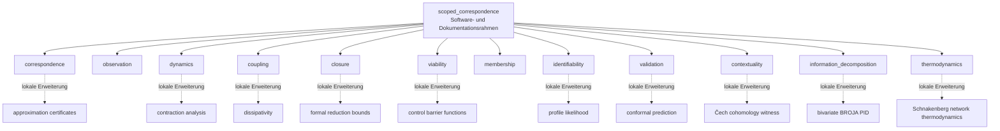
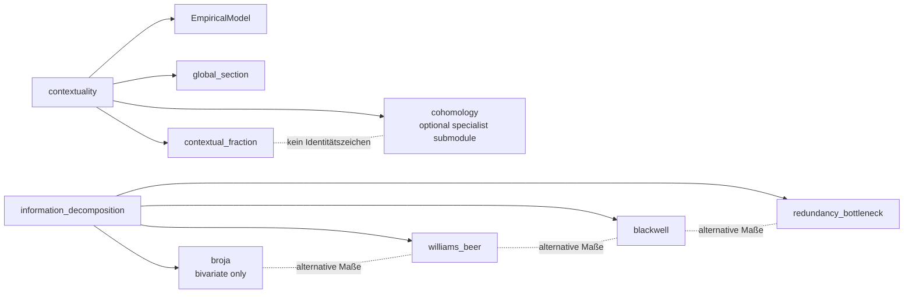

# Naming und nächste natürliche Erweiterungen des Scoped Correspondence Formalism

## Executive Summary

Die wichtigste Erkenntnis vorweg: **Die Namensentscheidung ist im Kern bereits richtig gefallen.** Der frühere Oberbegriff **CREP–UTAC–AFET sollte aus allen neuen öffentlichen APIs, neuen wissenschaftlichen Texten und neuen Paketen verschwinden** und nur noch als historisches Legacy-Vokabular erhalten bleiben. Das aktuelle Repository hat diesen Schnitt inzwischen tatsächlich vollzogen: Der alte GitHub-Pfad wird auf `GenesisAeon/scoped-correspondence-formalism` aufgelöst, das README nennt das System **Scoped Correspondence Formalism** und ordnet CREP → `Observation`, UTAC → `Dynamics`, AFET → `Coupling`; die frühere „Selbstähnlichkeit“ als Oberbehauptung wurde durch den schwächeren, explizit scope-gebundenen Begriff `Correspondence` ersetzt. fileciteturn3file0L2-L2 Die Entscheidung entspricht genau der Sorge aus dem Gespräch mit Claude-Code: Die alten Akronyme klangen stärker vereinheitlichend, als die Mathematik tatsächlich war, und haben dadurch Gleichsetzungen wie \(\beta=S\), \(V=\) Panarchy \(=L\) oder ein vermeintlich universelles \(\sigma\) semantisch begünstigt. fileciteturn0file1

**Meine klare Empfehlung lautet deshalb: den Namen `Scoped Correspondence Formalism` behalten. Kein neues Dach-Akronym mehr erfinden.** Der Name ist wissenschaftlich defensiv: *Correspondence* behauptet weder Identität noch Isomorphie noch Konjugiertheit, und *Scoped* macht die Geltungsbedingungen zum Bestandteil der Aussage. Genau das verlangt inzwischen auch das Repo-eigene Glossar. fileciteturn4file0L2-L2 Begriffe wie *natural equivalence*, *conjugacy*, *bisimulation*, *sheaf* oder *PID* haben in ihren jeweiligen Literaturen bereits technisch starke Bedeutungen; sie sollten daher nur verwendet werden, wenn der jeweilige mathematische Vertrag tatsächlich erfüllt ist. Schon Eilenberg und Mac Lane führten „natural equivalence“ als einen präzisen kategorientheoretischen Begriff ein, nicht als allgemeines Synonym für Ähnlichkeit. citeturn17search4

Die zweite wichtige Erkenntnis ist überraschend: **Der Softwareausbau, der im ursprünglichen Architekturplan noch wie die „nächste Phase“ aussah, ist Stand 17. September 2026 bereits weitgehend erfolgt.** `correspondence`, `observation`, `dynamics`, `coupling`, `closure`, `viability`, `membership`, `identifiability`, `validation`, `contextuality`, `information_decomposition` und `thermo` existieren bereits unter `src/scoped_correspondence/`; selbst der erste reale Datenpilot ist inzwischen dokumentiert. fileciteturn5file0L2-L2 fileciteturn7file0L2-L2 Der nächste logische Schritt ist deshalb **nicht noch mehr horizontale Breite**, sondern die mathematische Vertiefung bereits vorhandener Module durch stärkere, zitierfähige Zertifikate.

Dabei sollte der im neuen Deep-Research-Prompt formulierte harte Grundsatz unverändert gelten: **jede Erweiterung erweitert genau einen vorhandenen Baustein; keine Erweiterung darf zwei Module durch einen gemeinsamen Parameter, eine gemeinsame Konstante oder eine angebliche Metatheorie identifizieren.** Structured Cospans, Netzwerksteuerbarkeit, N-Quellen-PID, gewichtete Membership, Mori–Zwanzig als Vollausbau, RG-Universalität, Causal States und Metaregeln sind ausdrücklich bereits geprüft bzw. zurückgestellt und werden hier daher nicht als „neue Ideen“ recycelt. fileciteturn0file0

Aus der Literaturrecherche ergeben sich **zehn wirklich natürliche, voneinander unabhängige Erweiterungen**. Vier davon würde ich klar zuerst angehen:

| Rangklasse | Erweiterung | Bestehendes Modul | Warum jetzt? |
|---|---|---|---|
| **hoch** | Approximate Simulation / Approximation Certificates | `correspondence` | macht aus punktweisen Residuen echte Fehlerzertifikate |
| **hoch** | Formal State-Reduction Error Bounds | `closure` | direkte Verallgemeinerung des vorhandenen \(k\delta_{\rm cl}\)-Bounds |
| **hoch** | Control Barrier Functions | `viability` | operationalisiert sichere Eingriffe als prüfbare Ungleichung |
| **hoch** | Split Conformal Prediction | `validation` | ergänzt Holdout-Disziplin um endliche, distribution-free Vorhersageintervalle |
| mittel–hoch | Dissipativity / Supply Rates | `coupling` | allgemeiner Kopplungsvertrag ohne Thermodynamik zu behaupten |
| mittel–hoch | Profile Likelihood | `identifiability` | schließt die Lücke zwischen SVD/Konditionierung und praktischer Identifizierbarkeit |
| mittel–hoch | Schnakenberg Network Thermodynamics | `thermodynamics` | perfekte Vertiefung des vorhandenen Drei-Zyklus-Gegenbeispiels |
| mittel | Contraction Analysis | `dynamics` | sauberes dynamisches Konvergenzzertifikat, regional statt universal |
| mittel | BROJA-artige bivariate PID | `information_decomposition` | methodische Gegenprobe zu \(I_{\min}\)/Blackwell-RB |
| niedrig–mittel | Čech-Cohomology Witness | `contextuality` | mathematisch stark, aber aufwendiger und nur hinreichendes Witness |

Eine kleine, aber wichtige Korrektur zum Teststand: Das Repository hat nicht mehr nur „19+16 und F08/F09“. Der historische Bestand umfasst inzwischen **19 Basisprüfungen + 16 Extension-Prüfungen + 18 Transformationstests + 6 F08-Tests + 7 F09-Tests = 66 provenance-erhaltende Prüfungen**. Genau diese IDs sollten niemals neu nummeriert werden. fileciteturn6file0L2-L2

## Namensarchitektur und Konventionen

### Der Dachname

Unter den plausiblen Alternativen ist der inzwischen gewählte Name nicht nur brauchbar, sondern meines Erachtens der beste.

| Option | Wissenschaftliche Klarheit | Risiko einer Überbehauptung | Anschlussfähigkeit | Urteil |
|---|---|---|---|---|
| **Scoped Correspondence Formalism** | sehr hoch | sehr niedrig | hoch | **behalten** |
| Scoped Model Correspondence | sehr hoch | sehr niedrig | hoch | gute Alternative, aber erneute Umbenennung bringt keinen Gewinn |
| Typed Model Correspondence | hoch | niedrig | sehr gut für Software | verliert den zentralen Scope-Gedanken im Namen |
| Scoped Structural Correspondence | mittel–hoch | niedrig | mittel | „structural“ bleibt unspezifisch |
| Conditional Self-Similarity Framework | mittel | mittel–hoch | mittel | reaktiviert genau den problematischen Selbstähnlichkeits-Oberbegriff |
| CREP–UTAC–AFET Formalism | niedrig für Außenstehende | **hoch** | niedrig | nur historisch |

Die Wahl von *Correspondence* ist dabei gerade deshalb gut, weil das Wort **semantisch schwächer** als `equivalence`, `isomorphism`, `conjugacy` oder `bisimulation` ist. Für stärkere Relationen existieren etablierte mathematische Verträge. Girard und Pappas unterscheiden beispielsweise ausdrücklich exakte Simulation/Bisimulation von **approximate simulation/bisimulation** und führen Pseudometriken ein, um Abweichungen zu quantifizieren. citeturn11search0 Das passt sehr gut zur Philosophie des Repos: Der generische Kern heißt `Correspondence`; mathematisch stärkere Fälle werden darunter als spezialisierte Zertifikate modelliert.

Das aktuelle Repo formuliert bereits dieselbe Regel: starke mathematische Begriffe sollen nur verwendet werden, wenn ihr Vertrag erfüllt ist; Rollen sollen nach ihrer Funktion statt nach ihrer historischen Herkunft heißen; `project`, `restrict` und `lift` sollen Richtung sichtbar machen; Verification und Validation bleiben getrennt. fileciteturn4file0L2-L2

### Die Kernschichten

Ich würde die jetzigen drei öffentlichen Rollennamen **nicht mehr ändern**:

| Historisch | Öffentlicher Name | Paket | Bedeutung | Beispieltypen |
|---|---|---|---|---|
| CREP | **Observation** | `observation` | Messung, Kanal, Informationszugang | `ObservationChannel`, `ObservationReport` |
| UTAC | **Dynamics** | `dynamics` | Zustand, Evolution, Stabilität, Antwort | `DynamicalModel`, `Equilibrium`, `RecoveryReport` |
| AFET | **Coupling** | `coupling` | gerichtete Wechselwirkung, Fluss, Kopplungsstruktur | `CouplingOperator`, `CouplingReport` |
| AFET-Thermo-Sonderfall | **Thermodynamics** | derzeit `thermo` | physikalisch qualifizierte thermodynamische Struktur | `GenericStructureReport`, `MarkovThermoReport` |
| Selbstähnlichkeit als Dachbegriff | **Correspondence** | `correspondence` | transformationale Beziehung mit explizitem Scope und Fehler | `Correspondence`, `Scope`, `Residual` |

Diese Zuordnung ist bereits verbindlich im Repository dokumentiert. fileciteturn3file0L2-L2 fileciteturn4file0L2-L2

Bei `thermo` sehe ich den einzigen kleinen Rest an terminologischer Inkonsistenz: **wissenschaftlicher öffentlicher Begriff `Thermodynamics`, Importpfad derzeit `thermo`**. Weil das Paket noch bei `0.8.0a1` liegt, wäre eine einmalige Normalisierung zu `thermodynamics` vor 1.0 vertretbar; SemVer behandelt \(0.y.z\) ausdrücklich als Entwicklungsphase ohne stabile öffentliche API. fileciteturn10file0L2-L2 citeturn16search0 Ich würde das aber nur zusammen mit dem finalen API-Freeze tun. Ein bloß kosmetischer Rename außerhalb dieses Fensters lohnt sich nicht.

### F08 und F09

**F08 und F09 sollten niemals die öffentlichen Modulnamen sein.** Sie sind Provenienz-/Ticketnummern.

Für F08 ist die bestehende Trennung genau richtig:

```text
concept:      Contextuality
package:      contextuality
method:       sheaf contextuality / global-section test / contextual fraction
legacy id:    F08
```

Der Abramsky–Brandenburger-Formalismus beschreibt empirische Modelle über Messkontexten und charakterisiert Kontextualität über das Fehlen globaler Schnitte; der Contextual Fraction quantifiziert anschließend Kontextualität mittels linearer Optimierung. citeturn14academia12turn14search0 Das aktuelle API folgt bereits diesem Muster mit `EmpiricalModel`, `SheafScenario`, `has_global_section()` und `contextual_fraction()`. fileciteturn13file0L2-L2

Für F09 gilt analog:

```text
concept:      Information Decomposition
package:      information_decomposition
methods:      Williams–Beer I_min
              Blackwell redundancy
              Redundancy Bottleneck
legacy id:    F09
```

Das ist wesentlich präziser als ein Paket namens nur `pid`, weil PID eine **Familie von Zerlegungsproblemen und Maßdefinitionen** ist, nicht ein einzelner Algorithmus. Williams und Beer begründen die ursprüngliche Partial Information Decomposition über Redundanz und einen Redundanzverband; Kolchinsky schlägt später Blackwell-basierte Definitionen und den Redundancy Bottleneck als andere methodische Instanzen vor. citeturn14academia14turn15search2turn15academia36 Das aktuelle Repo trennt entsprechend bereits `i_min_two_sources`, `pid_atoms_williams_beer`, `blackwell_redundancy_*` und `rb0_blackwell`. fileciteturn14file0L2-L2

### Interfaces, Funktionen und Typen

Für Python sollte die wissenschaftliche Semantik mit den etablierten Sprachkonventionen zusammenfallen: Module und Funktionen in `snake_case`, Klassen/Typen in `CapWords`, Fehlerklassen mit `Error`-Suffix und explizite öffentliche APIs. PEP 8 empfiehlt genau diese Trennung. citeturn15search1

Die entscheidende zusätzliche Regel sollte lauten:

> **Nomen bezeichnen mathematische Objekte oder Zertifikate; Verben bezeichnen Operationen; Adjektive oder starke mathematische Fachwörter werden nur verwendet, wenn ihr Vertrag explizit nachgewiesen wird.**

Damit würde ich folgende Konventionen festschreiben:

| Kategorie | Bevorzugt | Vermeiden | Grund |
|---|---|---|---|
| Objekt | `Correspondence`, `Scope`, `Residual` | `CREPObject`, `AFETMap` | Funktion statt Geschichte |
| gerichtete Abbildung | `project`, `restrict`, `lift`, `push_forward`, `pull_back` | generisches `transform` überall | Richtung ist mathematisch relevant |
| Prüfung | `check_*`, `verify_*` | `prove_*` für Numerik | Rechentest ist kein formaler Beweis |
| Schätzung | `estimate_*` | `compute_true_*` | epistemischen Status sichtbar halten |
| Zertifikat | `ContractionCertificate`, `BarrierCertificate` | `ContractionResult` ohne Semantik | sagt, welche Art Evidenz geliefert wird |
| Berichte | `*Report` | unstrukturierte Dicts | maschinenlesbarer Evidenzvertrag |
| mathematische Spezialrelation | `verify_conjugacy` nur mit Invertibilitätsvertrag | jedes \(T\Phi\approx\Phi T\) „conjugacy“ nennen | keine Begriffsinflation |
| Tests | `test_<claim>_<condition>` | `test1`, `test_f08` | Inhalt bleibt lesbar |
| stabile Test-ID | `VER-CTX-*`, `VER-VIA-CBF-*` | Neuvergabe der alten IDs | Provenienz bleibt erhalten |

Hier zeigt sich sogar ein **konkreter Naming-Gap im jetzigen Code**. `StateMap` enthält momentan `map_fn`, `name` und `differentiable`, aber **keine inverse Abbildung oder Invertibilitätsbescheinigung**; dennoch heißen Methoden `conjugacy_residual()` und `verify_conjugacy()`. fileciteturn9file0L2-L2 Gemäß der eigenen Glossarregel „conjugacy nur bei echter Konjugation“ sollte der generische Fall besser heißen:

```python
flow_residual(...)
verify_correspondence(...)
```

und der stärkere Fall:

```python
verify_semiconjugacy(...)
verify_conjugacy(...)
```

sollte einen expliziten Vertrag verlangen, etwa:

```python
@dataclass(frozen=True)
class InvertibleStateMap:
    forward: StateTransform
    inverse: StateTransform
```

plus Roundtrip-Prüfung. Das ist keine mathematische Änderung, sondern verhindert, dass der Methodenname mehr behauptet als die Datenstruktur beweisen kann.

Ein zweiter kleiner Gap ist `ErrorMetric`: Die aktuelle Klasse implementiert im Wesentlichen `atol`, `rtol` und `near()`, aber keine Distanzfunktion. fileciteturn9file0L2-L2 „Metric“ ist mathematisch stärker als „Toleranzpolicy“. Entweder sollte sie daher in

```python
TolerancePolicy
```

umbenannt werden, oder `ErrorMetric` bekommt tatsächlich eine Operation

```python
distance(a, b) -> float
```

und die Toleranz wird getrennt:

```python
ErrorMetric
TolerancePolicy
```

Das wäre vor einem 1.0-API-Freeze eine sinnvolle Bereinigung.

Ebenso würde ich `CorrespondenceReport.kind: str` und `Residual.kind: str` langfristig durch Enums ersetzen:

```python
class RelationKind(Enum):
    CORRESPONDENCE = ...
    SEMICONJUGACY = ...
    CONJUGACY = ...
    APPROXIMATE_SIMULATION = ...

class VerificationEvidenceKind(Enum):
    MATHEMATICAL = ...
    NUMERICAL = ...
    COUNTEREXAMPLE = ...
    CONTRACT = ...

class ValidationEvidenceKind(Enum):
    SYNTHETIC = ...
    EMPIRICAL_IN_SAMPLE = ...
    EMPIRICAL_HOLDOUT = ...
    EXTERNAL_REPLICATION = ...
```

Gerade die letzte Trennung passt zu dem im Repo bereits festgelegten Prinzip, synthetische Verification und empirische Validation nicht semantisch zu vermischen. fileciteturn5file0L2-L2

## Zielarchitektur und Modulgrenzen

Der Formalismus sollte **nicht als Hierarchie mathematischer Reduktionen** dargestellt werden. Die Module sind Geschwister unter einem Softwarepaket; die gestrichelten Erweiterungen unten bedeuten nur „erweitert dieses Modul“, niemals „ist mathematisch dasselbe wie“.



Das entspricht auch der aktuellen tatsächlichen Paketstruktur: Die Kern- und Zusatzmodule existieren inzwischen separat unter `src/scoped_correspondence/`; insbesondere F08/F09 sind inzwischen keine losen Skripte mehr, sondern echte typed modules. fileciteturn7file0L2-L2

Für die beiden informationsmathematisch anspruchsvolleren Module würde ich diese interne Struktur empfehlen:



Die gestrichelten Beziehungen in der unteren Hälfte sind wichtig: Verschiedene PID-Maße dürfen **nebeneinander berichtet** werden, statt durch einen „richtigen“ universellen PID-Wert ersetzt zu werden. Dass verschiedene Konstruktionen tatsächlich unterschiedliche Eigenschaften besitzen, ist ein zentrales Thema der PID-Literatur selbst. Williams–Beer definiert \(I_{\min}\), Bertschinger et al. schlagen eine andere bivariate Konstruktion vor, und Kolchinsky wiederum Blackwell- und Bottleneck-basierte Ansätze. citeturn14academia14turn12search0turn15search2turn15academia36 Genau diese methodische Pluralität sollte das API sichtbar lassen.

## Natürliche mathematische Erweiterungen

Die folgende Auswahl respektiert ausdrücklich den angehängten Forschungsauftrag: keine Cross-Layer-Identitäten, keine Universalität, keine erneute Empfehlung bereits zurückgestellter Themen und möglichst handrechenbare Gegen-/Positivbeispiele. fileciteturn0file0 Die Vorschläge sind **nach bestehendem Baustein**, nicht nach Priorität sortiert.

| Bestehendes Modul | Erweiterung | Kernnutzen | API-Kern | Aufwand | Priorität |
|---|---|---|---|---|---|
| `correspondence` | Approximate Simulation / Bisimulation Certificates | Residuum → quantifiziertes Modellrelations-Zertifikat | `ApproximationCertificate` | mittel | **hoch** |
| `dynamics` | Contraction Analysis | regionale/globale Trajektorienkonvergenz | `ContractionCertificate` | mittel | mittel |
| `coupling` | Willems Dissipativity | allgemeine Energie-/Supply-Ungleichung ohne Thermo-Identität | `DissipativityCertificate` | mittel | mittel–hoch |
| `closure` | Formal Markov Reduction Error Bounds | stärkere Fehlergrenzen für Aggregation | `ReductionErrorBound` | mittel | **hoch** |
| `viability` | Control Barrier Functions | kontinuierliche sichere Eingriffsmenge | `BarrierCertificate` | mittel–groß | **hoch** |
| `identifiability` | Profile Likelihood | strukturelle vs. praktische Nichtidentifizierbarkeit | `ProfileLikelihoodReport` | mittel | mittel–hoch |
| `validation` | Split Conformal Prediction | endliche prediction intervals mit Coverage-Garantie | `ConformalReport` | mittel | **hoch** |
| `contextuality` | Čech Cohomology Obstruction | algebraisches Kontextualitäts-Witness | `CohomologyWitness` | groß | niedrig–mittel |
| `information_decomposition` | BROJA/bivariate unique information | zweites PID-Maß als methodische Gegenprobe | `BivariatePIDReport` | mittel–groß | mittel |
| `thermodynamics` | Schnakenberg Network Thermodynamics | Currents, affinities, entropy production für Markovzyklen | `MarkovThermoReport` | mittel | mittel–hoch |

**Correspondence — Approximation Metrics nach Girard & Pappas.**  
Girard und Pappas entwickeln approximate language inclusion, approximate simulation und approximate bisimulation sowie zugehörige Pseudometriken gerade für den Fall, dass exakte Gleichheit der beobachtbaren Dynamik zu restriktiv ist. Die exakten Relationen erscheinen dabei als Null-Fehler-Fälle. citeturn11search0 Das ist nahezu maßgeschneidert für den jetzigen Kern

\[
T\circ\Phi_j^t \approx \Phi_k^{ct}\circ T,
\]

denn `Correspondence` besitzt bereits `Scope`, `StateMap`, `TimeMap`, `Residual` und punktweise Residuenberechnung. fileciteturn9file0L2-L2

Der entscheidende Ausbau wäre **nicht** ein neues Dachmodul `bisimulation`, sondern:

```python
@dataclass(frozen=True)
class ApproximationCertificate:
    epsilon: float
    metric: DistanceMetric
    relation_kind: RelationKind
    scope: Scope
    assumptions: tuple[str, ...]
    witnessed_pairs: tuple[StatePair, ...]

def verify_approximate_simulation(...) -> ApproximationCertificate: ...
```

Ein minimales handrechenbares Beispiel wäre

\[
\dot x=-x,\qquad
\dot y=-y+0.1,\qquad x(0)=y(0)=0.
\]

Dann

\[
x(t)=0,\qquad y(t)=0.1(1-e^{-t}),
\]

also

\[
|x(t)-y(t)|\le 0.1
\]

für jedes \(t\ge0\). Das ist zunächst nur ein einfacher deterministischer Fehlerbound; die Implementierung muss anschließend die tatsächlichen Bedingungen der gewählten Approximate-Simulation-Definition abbilden, statt diesen Trajektorienbound einfach „Bisimulation“ zu nennen. Genau diese terminologische Disziplin wäre der Gewinn.

**Dynamics — Contraction Analysis nach Lohmiller & Slotine.**  
Contraction Theory untersucht infinitesimale Abstände benachbarter Trajektorien und liefert Bedingungen, unter denen sie exponentiell zusammenlaufen. Die klassische Arbeit von Lohmiller und Slotine formuliert dies über eine verallgemeinerte Jacobi-Matrix bzw. ein kontrahierendes Differentialmaß. citeturn9search0 In einer eindimensionalen euklidischen Spezialform genügt

\[
f'(x)\le -\lambda <0,
\]

woraus ein exponentieller Abstandsbund

\[
|\delta x(t)|\le e^{-\lambda t}|\delta x(0)|
\]

folgt.

Für die vorhandene kubische Dynamik

\[
\dot x=-x^3+ax+b
\]

ist

\[
f'(x)=-3x^2+a.
\]

Bei \(a=-1\) gilt daher global

\[
f'(x)=-3x^2-1\le -1,
\]

also ist diese konkrete Modellinstanz global kontrahierend. Bei \(a>0\) gilt dagegen \(f'(0)=a>0\); damit scheitert bereits der globale euklidische Kontraktionstest. Das ist wissenschaftlich sehr wertvoll, weil der Formalismus dadurch **keine neue Universalität**, sondern unmittelbar einen Scope-Gegenfall bekommt.

```python
ContractionCertificate(
    rate=1.0,
    domain=RealLine(),
    metric="euclidean",
)

check_contraction_1d(...)
check_contraction_metric(...)
```

Tests:

```text
VER-DYN-CON-001  test_cubic_a_minus_one_is_globally_contracting
VER-DYN-CON-002  test_positive_a_fails_global_euclidean_contraction
```

**Coupling — Dissipativity nach Willems.**  
Willems definiert Dissipativität durch eine Ungleichung zwischen einer Speicherfunktion \(V\) und einer Supply Rate \(w\); seine Theorie behandelt außerdem explizit Interkonnektionen dissipativer Systeme. citeturn10search0 In differentieller Form lautet der elementare Vertrag

\[
\dot V(x)\le w(u,y).
\]

Das ergänzt `coupling` ideal, weil es einen allgemeinen Kopplungs-/Austauschvertrag liefert, **ohne Coupling mit Thermodynamik gleichzusetzen**.

Handbeispiel:

\[
\dot x_i=-x_i+u_i,\qquad y_i=x_i,\qquad
V_i=\frac12 x_i^2.
\]

Dann

\[
\dot V_i=-x_i^2+y_i u_i.
\]

Bei neutraler Interkonnektion

\[
u_1=-y_2,\qquad u_2=y_1
\]

heben sich die Supply-Terme auf:

\[
y_1u_1+y_2u_2=-y_1y_2+y_2y_1=0,
\]

also

\[
\dot V_{\rm total}=-(x_1^2+x_2^2).
\]

Bei \(x_1=1,x_2=2\):

\[
\dot V_{\rm total}=-5.
\]

API:

```python
class DissipativityCertificate: ...
def check_storage_inequality(...): ...
def check_neutral_interconnection(...): ...
```

Das sollte **unter `coupling/dissipativity.py`** leben, nicht unter `thermodynamics`, solange keine thermodynamische Interpretation der Speicher- und Supply-Größen bewiesen wird.

**Closure — formale Fehlergrenzen für Markov-Aggregation nach Michel & Siegle.**  
Das bestehende Modul besitzt bereits exakte Geschlossenheit \(PC=CQ\), den one-step Defect

\[
\delta_{\rm cl}
=\max_i \operatorname{TV}\big((PC)_i,(CQ)_i\big)
\]

und den elementaren Horizontbound

\[
\operatorname{TV}(pP^kC,pCQ^k)
\le \min(1,k\delta_{\rm cl}).
\]

Das ist im aktuellen Code explizit implementiert. fileciteturn12file0L2-L2 Michel und Siegle entwickeln 2024/2025 allgemeinere formale Fehlergrenzen für diskrete und kontinuierliche Markovketten: im diskreten Fall Grenzen für den **schrittweisen Fehlerzuwachs**, im kontinuierlichen Fall für die **Fehlerwachstumsrate**; die Theorie umfasst Aggregation/Lumpability als Spezialfall. citeturn10search6turn10academia49

Hier sollte also nicht `closure_error()` ersetzt, sondern eine zusätzliche Ebene eingeführt werden:

```python
@dataclass(frozen=True)
class ReductionErrorBound:
    horizon: int | float
    bound: float
    norm: str
    theorem: str
    assumptions: tuple[str, ...]

def transient_reduction_bound(...): ...
def stationary_reduction_bound(...): ...
```

Kompatibilitätsprüfung:

```text
VER-CLS-ERR-001
current_linear_bound(delta_cl=0.05, k=4) == 0.20
```

Danach sollte mindestens ein kleines Beispiel aus Michel–Siegle exakt reproduziert werden. Erst wenn dessen theorem-specific bound implementiert ist, darf das neue Verfahren gegenüber `min(1,kδ)` als „stärker“ bezeichnet werden.

**Viability — Control Barrier Functions.**  
Ames, Xu, Grizzle und Tabuada formulieren Safety als Vorwärtsinvarianz einer zulässigen Menge und Control Barrier Functions als Ungleichungsbedingungen an den Steuereingang, deren Erfüllung die Invarianz sichert. citeturn10search1turn10academia48 Für ein control-affines System

\[
\dot x=f(x)+g(x)u
\]

und die sichere Menge

\[
\mathcal C=\{x:h(x)\ge0\}
\]

ist der typische Zeroing-CBF-Vertrag

\[
L_fh(x)+L_gh(x)u+\alpha(h(x))\ge0.
\]

Das schließt direkt an `viability` an, ohne `dynamics`, `coupling` oder `membership` zu vereinnahmen.

Mini-Beispiel:

\[
\dot x=u,\qquad h(x)=x,\qquad \alpha(h)=h.
\]

Dann lautet die Bedingung

\[
u+x\ge0.
\]

Bei \(x=0.2\):

\[
u=-0.1 \Rightarrow -0.1+0.2=0.1\ge0
\]

ist zulässig, aber

\[
u=-0.3 \Rightarrow -0.3+0.2=-0.1<0
\]

nicht.

```python
@dataclass(frozen=True)
class BarrierFunction:
    h: Callable
    alpha: Callable

@dataclass(frozen=True)
class BarrierCertificate:
    safe: bool
    margin: float
    admissible_controls: ControlSet

def admissible_controls_cbf(...): ...
def verify_forward_invariance(...): ...
```

Das wäre wahrscheinlich die **praktisch stärkste mathematische Erweiterung des vorhandenen sicheren Eingriffsübertragungssatzes**, weil aus einer statischen Verträglichkeitsprüfung ein kontinuierlicher Safety-Contract entsteht.

**Identifiability — Profile Likelihood.**  
Raue et al. führen Profile Likelihood gerade ein, um strukturelle und praktische Nichtidentifizierbarkeit in teilweise beobachteten dynamischen Modellen zu unterscheiden; dabei werden die jeweils anderen Parameter für einen festgehaltenen Parameter neu optimiert. citeturn13search0 Formal:

\[
\chi^2_{\rm PL}(\theta_i)
=
\min_{\theta_{j\ne i}}\chi^2(\theta).
\]

Das ist eine sehr natürliche Ergänzung zur vorhandenen Konditionierungs-/SVD-Diagnostik, weil lokale Krümmungsinformation und globale Profilstruktur unterschiedliche Fragen beantworten.

Für die bereits vorhandene Skalierungs-Nichtidentifizierbarkeit kann man das triviale Modell

\[
y=\theta_1\theta_2=6
\]

verwenden. Für jedes \(\theta_1>0\) existiert

\[
\theta_2=\frac6{\theta_1},
\]

so dass

\[
(1,6),\;(2,3),\;(3,2)
\]

denselben perfekten Fit liefern. Das Profile Likelihood bleibt entlang dieser Richtung flach: ein idealer Regressionstest gegen die bereits vorhandene e12-artige Nichtidentifizierbarkeit.

```python
ProfileLikelihoodReport(...)
profile_parameter(...)
likelihood_interval(...)
classify_identifiability(...)
```

Ein zweiter Test sollte einen identifizierbaren quadratischen Fit besitzen, damit „flach“ und „endlich geschlossen“ symmetrisch geprüft werden.

**Validation — Split Conformal Prediction.**  
Lei et al. entwickeln distribution-free predictive inference mittels conformal inference; der Ansatz benötigt keine parametrische Fehlerverteilung und liefert unter der entsprechenden Austauschbarkeitsannahme marginale Coverage-Garantien. citeturn12search1 Das ist bemerkenswert passend zur bereits vorhandenen `VAL-SPLIT`-Philosophie des Repos: Training/Kalibrierung dürfen nicht anschließend als unabhängiger Test ausgegeben werden. fileciteturn5file0L2-L2

Für Split Conformal wird ein Modell auf einem Trainingssatz angepasst, auf einem getrennten Kalibrierungssatz werden Scores, etwa absolute Residuen,

\[
R_i=|Y_i-\hat f(X_i)|
\]

bestimmt, und aus einem geeigneten empirischen Quantil \(q\) entsteht

\[
C(x)
=
[\hat f(x)-q,\;\hat f(x)+q].
\]

Handbeispiel:

\[
R=(1,1,2,3),\quad \alpha=0.2.
\]

Mit vier Kalibrationsfällen liegt der finite-sample Rank für \(1-\alpha\) beim vierten sortierten Wert, also \(q=3\). Für \(\hat y=10\):

\[
C(x)=[7,13].
\]

API:

```python
@dataclass(frozen=True)
class SplitConformalReport:
    alpha: float
    quantile: float
    calibration_size: int
    coverage_kind: Literal["marginal_exchangeable"]

def calibrate_split_conformal(...): ...
def predict_interval(...): ...
```

Wichtig wäre ein harter Leak-Guard:

```text
VAL-CONF-LEAK-001
test_calibration_rows_must_not_overlap_holdout
```

Damit würde die bestehende epistemische Trennung sogar softwareseitig verschärft.

**Contextuality — Čech-Cohomology Obstruction.**  
Abramsky, Mansfield und Barbosa bauen auf dem Sheaf-Formalismus auf und definieren eine Čech-Kohomologieklasse als Kontextualitätsobstruktion. Entscheidend: **Nichtverschwindende Obstruktion ist hinreichend für Kontextualität, aber nicht notwendig.** citeturn14academia13 Genau dieser asymmetrische epistemische Status muss im API stehen.

Deshalb:

```python
@dataclass(frozen=True)
class CohomologyWitness:
    obstruction_nonzero: bool
    degree: int
    coefficient_ring: str
    proves_contextuality: bool

def cech_obstruction(...) -> CohomologyWitness: ...
```

und explizit **nicht**:

```python
is_contextual = not obstruction_vanishes
```

Der negative Regressionstest ist wichtiger als der positive:

```text
VER-CTX-COH-003
test_vanishing_obstruction_does_not_certify_noncontextuality
```

Als positives Mini-Beispiel kann ein in der Originalarbeit behandelter PR-Box-Fall reproduziert werden; die Autoren berichten nichtverschwindende Obstruktionen unter anderem für PR-Boxen, GHZ, Peres–Mermin und die 18-Vektor-Konfiguration. citeturn14academia13 Aufwand: eher groß, weil hier echte kombinatorische Kohomologie implementiert werden muss.

**Information Decomposition — bivariate BROJA-artige Unique Information.**  
Bertschinger, Rauh, Olbrich, Jost und Ay definieren bivariate Unique Information über eine Optimierung über alle gemeinsamen Verteilungen, welche die relevanten Ziel–Quelle-Paarmarginalen unverändert lassen. citeturn12search0 Für Ziel \(X\) und Quellen \(Y,Z\):

\[
\Delta_P
=
\left\{
Q:
Q_{XY}=P_{XY},\;
Q_{XZ}=P_{XZ}
\right\},
\]

und

\[
\widetilde{UI}(X:Y\setminus Z)
=
\min_{Q\in\Delta_P}
I_Q(X;Y\mid Z).
\]

Das ist genau die Art Erweiterung, die F09 braucht: **eine alternative bivariate Definition als Vergleichsmaß**, nicht ein neuer Universal-PID.

```python
@dataclass(frozen=True)
class BivariatePIDReport:
    redundancy: float
    unique_source_1: float
    unique_source_2: float
    synergy: float
    method: Literal["broja"]

def broja_pid_bivariate(...) -> BivariatePIDReport: ...
```

Der wertvollste Test ist `TWO_BIT_COPY`, gerade weil das vorhandene Repo dort bereits die \(I_{\min}\)-Pathologie dokumentiert. fileciteturn14file0L2-L2 Für zwei unabhängige faire Bits \(Y,Z\) und \(X=(Y,Z)\) sollte das neue Maß **neben**, nicht statt, Williams–Beer und Blackwell/RB ausgegeben werden. Das erzwingt methodische Transparenz.

Wichtig: Dies ist ausdrücklich **keine N-Quellen-Verallgemeinerung**. Der Anhang hat diese bereits als größeres, offenes Forschungsfeld zurückgestellt. fileciteturn0file0

**Thermodynamics — Schnakenberg Network Thermodynamics.**  
Schnakenbergs klassische Arbeit entwickelt eine Netzwerkthermodynamik für Systeme mit linearer Mastergleichung und beschreibt Nichtgleichgewichtszustände mittels Flüssen und generalisierten Kräften; Onsager-Reziprozität erscheint darin als near-equilibrium Spezialfall, nicht als generelle Identität beliebiger Kopplungsmatrizen. citeturn15search0 Das passt außergewöhnlich gut zu eurem bereits vorhandenen Drei-Zyklus-Gegenbeispiel.

Für eine kontinuierliche Markovkette sind die stationären Kantenströme

\[
J_{ij}=p_i k_{ij}-p_jk_{ji}
\]

und die lokale Affinität

\[
A_{ij}
=
\ln\frac{p_i k_{ij}}{p_jk_{ji}}.
\]

Die Entropieproduktion kann als

\[
\dot S_{\rm prod}
=
\frac12\sum_{i,j}
J_{ij}
\ln\frac{p_i k_{ij}}{p_j k_{ji}}
\ge0
\]

geschrieben werden.

Mini-Beispiel: symmetrischer Drei-Zyklus mit clockwise Rate \(2\) und counterclockwise Rate \(1\). Wegen Symmetrie ist

\[
p_1=p_2=p_3=\frac13.
\]

Auf jeder clockwise orientierten Kante:

\[
J=\frac13(2-1)=\frac13,
\qquad
A=\ln 2.
\]

Über die drei ungerichteten Kanten:

\[
\dot S_{\rm prod}
=
3\cdot\frac13\ln2
=
\ln2
\approx0.6931.
\]

Das wäre ein hervorragender Zusatz zum vorhandenen Test „stochastic inverse \(\neq\) detailed balance \(\neq\) thermodynamic reversibility“. Entscheidend: Dieses \(\dot S_{\rm prod}\) hat **keinerlei Identität mit irgendeinem früher verwendeten \(\sigma=2.2\)**. Genau diese Nichtidentität sollte der Test dokumentieren.

```python
@dataclass(frozen=True)
class MarkovThermoReport:
    edge_currents: np.ndarray
    affinities: np.ndarray
    entropy_production_rate: float
    detailed_balance: bool

def stationary_currents(...): ...
def cycle_affinity(...): ...
def entropy_production_rate(...): ...
```

Für **Observation** sehe ich derzeit keine Erweiterung, die gegenüber Kapazität, Retention, deklarierter \(EI_q\) und den bereits vorhandenen Informationszerlegungen genug Eigenwert besitzt, ohne sofort in F09 hineinzulaufen. Für **Membership** gilt dasselbe: Die naheliegende gewichtete Zugehörigkeit ist im Anhang bereits bewusst zurückgestellt, weil den Gewichten derzeit eine saubere Semantik fehlt. Hier ist „nichts hinzufügen“ wissenschaftlich stärker als ein künstlicher elfter und zwölfter Vorschlag. fileciteturn0file0

## Verifikation und Teststrategie

Die bestehende 66er-Suite sollte **als unveränderliche wissenschaftliche Provenienzschicht** betrachtet werden. Das Repository hat dafür bereits einen Alias-Namespace, der die originalen IDs erhält und sie öffentlichen Bereichen wie `VER-CORE-*`, `VER-REC-*`, `VER-CLS-*`, `VER-COR-T01…T18`, `VER-CTX-*` und `VER-PID-*` zuordnet. fileciteturn6file0L2-L2

Die neuen Tests sollten **nicht zwischen die alten IDs eingeschoben** werden. Sie bekommen neue disjunkte Namespaces:

| Neue Familie | Neue IDs | Anknüpfung an vorhandene Tests |
|---|---|---|
| Approximate Correspondence | `VER-COR-APP-*` | e11 Konjugation, e12 Skalierungs-Nichtidentifizierbarkeit, T01–T04 |
| Contraction | `VER-DYN-CON-*` | p01/p02 kubische Dynamik, Recovery-Checks |
| Dissipativity | `VER-CPL-DIS-*` | p05 symmetric/antisymmetric, p06 heat balance |
| Closure Error Bounds | `VER-CLS-ERR-*` | e04/e05/e06 sowie T07/T15/T16/T17 |
| Barrier Functions | `VER-VIA-CBF-*` | e14, T05/T09/T10/T12/T14 |
| Profile Likelihood | `VER-IDN-PL-*` | e12 sowie bestehende Identifiability-Suite |
| Conformal Validation | `VAL-CONF-*` | bestehender Holdout-/VAL-SPLIT-Vertrag |
| Cohomology | `VER-CTX-COH-*` | s01–s06 |
| BROJA PID | `VER-PID-BROJA-*` | p01–p07 F09, insbesondere TWO_BIT_COPY |
| Stochastic Thermodynamics | `VER-TH-STOCH-*` | e10 und e13 |

Konkrete sinnvolle Regressionstests wären:

| Test-ID | Behauptung |
|---|---|
| `VER-COR-APP-001` | exakte Correspondence liefert Approximationfehler \(0\) |
| `VER-COR-APP-002` | bekannter 0.1-Fehler wird nicht als exakte Konjugation klassifiziert |
| `VER-COR-APP-003` | größere zugelassene Toleranz kann einen zuvor ungültigen Certificate-Scope einschließen, aber nicht umgekehrt |
| `VER-DYN-CON-001` | \(a=-1,b=0\) kubisch: globale Rate mindestens \(1\) |
| `VER-DYN-CON-002` | \(a>0\): globale euklidische Kontraktion scheitert bei \(x=0\) |
| `VER-CPL-DIS-001` | neutrales Zweiersystem ergibt bei \((1,2)\) \(\dot V=-5\) |
| `VER-CPL-DIS-002` | absichtlich falsche Supply Rate verletzt Dissipativitätsvertrag |
| `VER-CLS-ERR-001` | Legacy-\(k\delta\)-Bound bleibt bit-/wertkompatibel |
| `VER-CLS-ERR-002` | exakte Lumpability erzeugt Fehlerbound \(0\) |
| `VER-VIA-CBF-001` | \(x=.2,u=-.1\) erfüllt Barrier Condition |
| `VER-VIA-CBF-002` | \(x=.2,u=-.3\) verletzt Barrier Condition |
| `VER-VIA-CBF-003` | Aktuatorgrenzen können CBF-QP infeasible machen |
| `VER-IDN-PL-001` | Produktparameter \(\theta_1\theta_2=6\) erzeugt flaches Profil |
| `VER-IDN-PL-002` | identifizierbares quadratisches Modell besitzt endliches Profilintervall |
| `VAL-CONF-001` | handgerechnete Residuen \((1,1,2,3)\) ergeben \(q=3\) |
| `VAL-CONF-LEAK-001` | Calibration/Holdout-Overlap wird abgewiesen |
| `VER-CTX-COH-001` | publiziertes PR-Box-Beispiel besitzt nichtverschwindendes Witness |
| `VER-CTX-COH-002` | globaler klassischer Schnitt erzeugt kein positives Obstruction-Witness |
| `VER-CTX-COH-003` | verschwindende Obstruktion wird **nicht** als Noncontextuality-Proof berichtet |
| `VER-PID-BROJA-001` | XOR bleibt Synergie-Sanity-Check |
| `VER-PID-BROJA-002` | TWO_BIT_COPY berichtet Methodenunterschied explizit |
| `VER-PID-BROJA-003` | Optimierung erhält beide Ziel–Quelle-Paarmarginalen |
| `VER-TH-STOCH-001` | Detailed Balance \(\Rightarrow \dot S_{\rm prod}=0\) |
| `VER-TH-STOCH-002` | 2:1-Drei-Zyklus ergibt \(\dot S_{\rm prod}=\ln2\) |
| `VER-TH-STOCH-003` | Cycle Affinity kann Vorzeichen mit Zyklusrichtung wechseln, Entropieproduktion bleibt nichtnegativ |

Für neue Python-Tests würde ich von den historischen `verify_*.py`-Dateinamen allmählich zu regulären `pytest`-Tests wechseln. Pytest entdeckt standardmäßig `test_*.py`/`*_test.py` und `test_*`-Funktionen und empfiehlt für neue Projekte eine externe `tests/`-Struktur zusammen mit dem `src/`-Layout. citeturn17search0

Das heißt aber **nicht**, die alten Verify-Skripte umzuschreiben. Besser:

```text
verification/
    legacy/
        verify_formalism.py
        verify_extensions.py
        verify_transformations.py
        verify_sheaf_contextuality.py
        verify_pid_rb.py
        golden/
            *.json

tests/
    verification/
        test_correspondence_approximation.py
        test_dynamics_contraction.py
        test_coupling_dissipativity.py
        test_closure_error_bounds.py
        test_viability_barriers.py
        test_identifiability_profiles.py
        test_contextuality_cohomology.py
        test_information_decomposition_broja.py
        test_thermodynamics_stochastic.py

    validation/
        test_conformal_prediction.py

    regression/
        test_legacy_equivalence.py
        test_historical_66.py
```

Damit entstehen drei sauber verschiedene Ebenen:

\[
\text{historical provenance}
\neq
\text{current mathematical verification}
\neq
\text{empirical validation}.
\]

Das ist meines Erachtens eine der wichtigsten Eigenschaften des ganzen Projekts.

## Migration, Versionierung und Repository-Struktur

Das Repo befindet sich laut aktuellem `pyproject.toml` bei **`0.8.0a1`** und heißt als Distribution bereits `scoped-correspondence`. fileciteturn10file0L2-L2 Damit liegt der ideale Zeitpunkt für den letzten Terminologie- und Contract-Cleanup **vor** `1.0.0`. SemVer definiert Version 0.x als Entwicklungsphase und 1.0.0 als Definition des stabilen öffentlichen API-Vertrags. citeturn16search0

Ich würde die Migration deshalb bewusst kleiner halten als ursprünglich gedacht. Die ~60 alten Ökosystempakete werden **nicht massenweise umbenannt**; genau das wurde im Gespräch mit Claude-Code bereits sinnvoll als zu teuer und wissenschaftlich unnötig erkannt. fileciteturn0file1 Das aktuelle Glossar dokumentiert denselben Ansatz: historische Pakete und Revisionsdokumente bleiben reproduzierbar, während neue APIs das neue Vokabular verwenden. fileciteturn4file0L2-L2

Empfohlene Zielstruktur:

```text
src/scoped_correspondence/
    correspondence/
        contract.py
        approximation.py

    observation/
        channels.py
        information.py

    dynamics/
        core.py
        contraction.py

    coupling/
        core.py
        dissipativity.py

    closure/
        core.py
        error_bounds.py
        reconstruction.py
        memory.py

    viability/
        core.py
        barriers.py

    membership/
        core.py

    identifiability/
        core.py
        profile_likelihood.py

    validation/
        core.py
        conformal.py

    contextuality/
        core.py
        sheaf.py
        cohomology.py

    information_decomposition/
        williams_beer.py
        blackwell.py
        redundancy_bottleneck.py
        broja.py

    thermodynamics/
        generic.py
        stochastic.py

    legacy/
        adapters.py
        terminology.py

    errors.py
```

Dabei ist nicht zwingend nötig, bestehende `core.py`-Dateien sofort aufzuspalten. Das ist die **Zielsemantik**, keine Forderung nach einem Big-Bang-Refactor.

Der Migrationsfluss sollte so aussehen:

```mermaid
flowchart LR
    A["0.8.x<br/>aktuellen API-Bestand inventarisieren"]
    B["Naming Freeze<br/>öffentliche Begriffe festlegen"]
    C["Generische Begriffe bereinigen<br/>conjugacy / ErrorMetric / thermo"]
    D["Legacy-Aliase hinzufügen<br/>keine alten Ecosystem-Pakete ändern"]
    E["Historical 66 + MIG-Suite<br/>vollständig grün"]
    F["0.9.x Beta<br/>Migration Guide + Deprecation Warnings"]
    G["API Audit<br/>Scope / Evidence / Validation-Typen"]
    H["1.0.0<br/>neue öffentliche API einfrieren"]
    I["1.x<br/>theorem-backed extensions hinzufügen"]
    J["2.0 frühestens<br/>Legacy-Aliase entfernen, falls überhaupt nötig"]

    A --> B --> C --> D --> E --> F --> G --> H --> I --> J
```



### Abwärtskompatibilität

Die Legacy-Schicht sollte absichtlich langweilig sein:

```python
# scoped_correspondence.legacy

CREP = Observation
UTAC = Dynamics
AFET = Coupling
```

bzw. wo Klassen nicht eins zu eins existieren, explizite Adapter statt Alias-Magie.

Neue Dokumentation darf diese Namen **nicht mehr als primäre Konzepte** benutzen. Sie tauchen nur noch in einem „Legacy terminology“-Abschnitt auf.

Ein sinnvoller Deprecation-Contract wäre:

```text
0.9.x:
    Legacy imports funktionieren.
    Sie erzeugen DeprecationWarning.
    Neue Beispiele verwenden sie nicht.

1.x:
    Legacy imports bleiben in scoped_correspondence.legacy verfügbar.
    Keine Re-Exports aus dem Top-Level.

2.0:
    Entfernung nur, falls reale Nutzung gering und Migration dokumentiert ist.
```

Das ist konservativer als SemVer zwingend verlangt, aber bei einem wissenschaftlichen Ökosystem sinnvoll: Reproduzierbarkeit alter Artefakte ist wertvoller als ein maximal „sauberes“ Namespace.

### Changelog

Jeder Release sollte neben Softwareänderungen ausdrücklich den epistemischen Status dokumentieren:

```markdown
## [0.9.0] - YYYY-MM-DD

### Added
- ...

### Changed
- ...

### Deprecated
- ...

### Removed
- ...

### Verification
- Historical checks: 66/66
- New mathematical checks: ...
- Counterexamples: ...

### Validation
- Dataset:
- Provenance:
- Calibration split:
- Holdout split:
- Baseline:
- External replication:

### Scientific scope
- Supported claims:
- Explicitly unsupported claims:
- Known counterexamples:
- Required assumptions:

### References
- DOI / arXiv ...
```

Gerade `Scientific scope` würde ich nicht als Schmuck behandeln, sondern als Release-Pflichtfeld. Das ist die Softwareversion dessen, was `Scope` im mathematischen Kern bereits ausdrückt.

### Release-Gate für 1.0

`1.0.0` sollte meines Erachtens **nicht** bedeuten „alle denkbaren Module sind fertig“. Es sollte nur bedeuten:

1. öffentliche Terminologie eingefroren;
2. `Correspondence`-Contract eingefroren;
3. `Scope` und Evidenztypen stabil;
4. kein neues CREP/UTAC/AFET in öffentlichen APIs;
5. historische 66/66 reproduzierbar;
6. Verification/Validation maschinell unterschieden;
7. Legacy-Adapter dokumentiert;
8. Migration Guide vorhanden;
9. zumindest ein reales Validation-Beispiel reproduzierbar;
10. alle öffentlich verwendeten starken mathematischen Begriffe besitzen einen expliziten Contract.

Da der reale Datenpilot inzwischen bereits existiert und die meisten ursprünglich geplanten Module bereits extrahiert wurden, ist dieser 1.0-Punkt erheblich näher, als die ältere Roadmap vermuten ließ. fileciteturn5file0L2-L2

## Primärquellen und wissenschaftliche Einordnung

Die kanonischen Primärarbeiten für die hier relevanten mathematischen Verträge sind überwiegend englischsprachig. Ich habe deutschsprachige Sekundärtexte bewusst **nicht** als wissenschaftliche Belege eingesetzt, weil der angehängte Rechercheauftrag echte arXiv-/DOI-Primärquellen fordert. fileciteturn0file0 Es gibt jedoch mehrere unmittelbare deutschsprachige bzw. deutsche institutionelle Anschlüsse: Raue et al. stammen wesentlich aus Freiburg/Heidelberg, Schnakenbergs Arbeit aus der RWTH Aachen; für SemVer existiert zudem eine offizielle deutsche Fassung. citeturn13search0turn15search0turn16search11

| Gebiet | Primärquelle | Relevanz für SCF |
|---|---|---|
| Kategorientheorie | Eilenberg & Mac Lane, 1945, *General Theory of Natural Equivalences*, DOI [10.1090/S0002-9947-1945-0013131-6](https://doi.org/10.1090/S0002-9947-1945-0013131-6) citeturn17search4 | Mahnung, „equivalence/natural“ nicht generisch zu verwenden |
| Approximate system relations | Girard & Pappas, 2007, DOI [10.1109/TAC.2007.895849](https://doi.org/10.1109/TAC.2007.895849) citeturn11search0 | Approximation Certificates für `correspondence` |
| Contraction | Lohmiller & Slotine, 1998, DOI [10.1016/S0005-1098(98)00019-3](https://doi.org/10.1016/S0005-1098(98)00019-3) citeturn9search0 | Konvergenzzertifikate für `dynamics` |
| Dissipativity | Willems, 1972, DOI [10.1007/BF00276493](https://doi.org/10.1007/BF00276493) citeturn10search0 | Storage-/Supply-Vertrag für `coupling` |
| Markov reduction | Michel & Siegle, 2025, DOI [10.1016/j.peva.2024.102464](https://doi.org/10.1016/j.peva.2024.102464), arXiv [2403.07618](https://arxiv.org/abs/2403.07618) citeturn10search6turn10academia49 | formale Closure-Fehlergrenzen |
| Safety Control | Ames et al., 2017, DOI [10.1109/TAC.2016.2638961](https://doi.org/10.1109/TAC.2016.2638961), arXiv [1609.06408](https://arxiv.org/abs/1609.06408) citeturn10search1turn10academia48 | Control Barrier Functions für `viability` |
| Identifizierbarkeit | Raue et al., 2009, DOI [10.1093/bioinformatics/btp358](https://doi.org/10.1093/bioinformatics/btp358) citeturn13search0 | Profile Likelihood |
| Predictive Validation | Lei et al., 2018, DOI [10.1080/01621459.2017.1307116](https://doi.org/10.1080/01621459.2017.1307116) citeturn12search1 | Split Conformal Prediction |
| Sheaf contextuality | Abramsky & Brandenburger, 2011, arXiv [1102.0264](https://arxiv.org/abs/1102.0264) citeturn14academia12 | theoretische Grundlage F08 |
| Contextual Fraction | Abramsky, Barbosa & Mansfield, 2017, DOI [10.1103/PhysRevLett.119.050504](https://doi.org/10.1103/PhysRevLett.119.050504) citeturn14search0 | quantitative F08-Methode |
| Cohomology contextuality | Abramsky, Mansfield & Barbosa, 2012, arXiv [1111.3620](https://arxiv.org/abs/1111.3620) citeturn14academia13 | optionales cohomologisches Witness |
| PID | Williams & Beer, 2010, arXiv [1004.2515](https://arxiv.org/abs/1004.2515) citeturn14academia14 | Ausgangspunkt F09 |
| Bivariate unique information | Bertschinger et al., 2014, DOI [10.3390/e16042161](https://doi.org/10.3390/e16042161) citeturn12search0 | BROJA-artige Gegenprobe |
| Blackwell PID | Kolchinsky, 2022, DOI [10.3390/e24030403](https://doi.org/10.3390/e24030403) citeturn15search2 | bestehender Blackwell-Anschluss |
| Redundancy Bottleneck | Kolchinsky, 2024, arXiv [2405.07665](https://arxiv.org/abs/2405.07665) citeturn15academia36 | bestehender RB-Anschluss F09 |
| Network thermodynamics | Schnakenberg, 1976, DOI [10.1103/RevModPhys.48.571](https://doi.org/10.1103/RevModPhys.48.571) citeturn15search0 | thermodynamische Vertiefung des Drei-Zyklus |
| Python Naming | PEP 8, Python Software Foundation citeturn15search1 | Paket-/Typ-/Funktionsnamen |
| Teststruktur | pytest, offizielle Dokumentation citeturn17search0 | `tests/`, `test_*.py`, incremental migration |
| Versionierung | Semantic Versioning 2.0.0 citeturn16search0turn16search11 | 0.9 → API Freeze → 1.0 |

Damit ergibt sich auch eine präzise wissenschaftliche Identität des Projekts:

> **Scoped Correspondence Formalism ist keine neue vereinheitlichte Systemtheorie. Es ist ein typisierter, scope-gebundener Rahmen für unabhängige mathematische Modellverträge und deren überprüfbare Korrespondenzen.**

Das ist stärker als das alte CREP–UTAC–AFET-Narrativ, gerade weil es weniger behauptet. `Observation`, `Dynamics` und `Coupling` sind Rollen; `Closure`, `Viability`, `Membership`, `Identifiability`, `Contextuality`, `Information Decomposition` und `Thermodynamics` sind spezialisierte Bausteine; `Correspondence` ist der explizite Übersetzungsvertrag zwischen Beschreibungen, nicht die Behauptung, dass diese Beschreibungen dieselbe Mathematik besitzen. Genau dieser Schnitt ist im aktuellen Repo bereits angelegt. fileciteturn3file0L2-L2

Und daraus folgt für die nächsten Releases eine ziemlich klare Forschungsstrategie: **keine neue große Theorie darüberlegen, sondern bestehende Module mit lokalen mathematischen Zertifikaten härten.** Approximation Certificates stärken `correspondence`; formale Aggregationsbounds stärken `closure`; Barrier Functions stärken `viability`; Conformal Prediction stärkt `validation`; Profile Likelihood stärkt `identifiability`; Dissipativity stärkt `coupling`; Schnakenberg stärkt `thermodynamics`. Jede Erweiterung bleibt lokal widerlegbar, lokal testbar und lokal zitierbar.

Die ursprünglich als „unspecified attachment“ bezeichnete Zusatzinformation ist inzwischen ausgelesen und enthält genau diese Einschränkung ausdrücklich. Nicht spezifiziert bleiben nur downstream-spezifische Details der bereits veröffentlichten Ökosystempakete — etwa welche ihrer öffentlichen Imports externe Nutzer tatsächlich verwenden — weshalb die vorgeschlagene Legacy-Schicht absichtlich konservativ bleibt. fileciteturn0file0