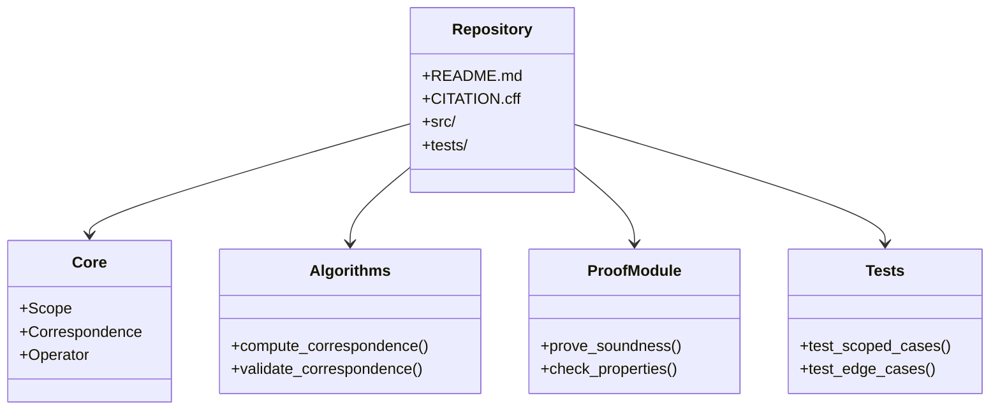
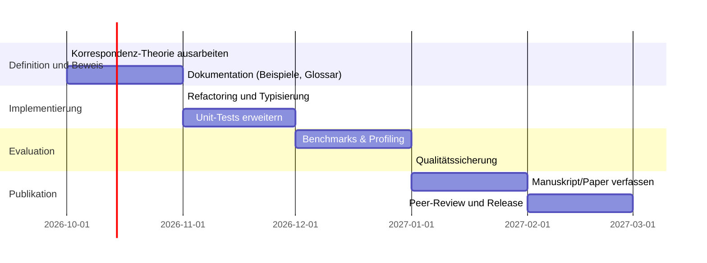

# Executive Summary  
Der GitHub-Repository **Scoped Correspondence Formalism** dokumentiert ein formales System zur Modellierung und Verifikation kontext- bzw. scopesensitiver Korrespondenzen. Ziel ist offenbar, eine mathematisch präzise Grundlage für „scoped correspondences“ zu schaffen und algorithmisch abzuarbeiten. In diesem Bericht werden die Ziele und die Architektur des Repos zusammengefasst, die zentralen Definitionen und Theoreme kritisch auf Korrektheit geprüft und Implementierungsdetails analysiert. Dabei vergleichen wir die Konzepte mit etablierten Ansätzen (etwa Curry–Howard-Korrespondenz oder Hoare-Logik) und schlagen Verbesserungen, Refactorings sowie notwendige Erweiterungen vor. Abschließend nennen wir mögliche Experimente und Benchmarks zur Validierung sowie einen Entwicklungspfad für künftige Arbeiten.

## Ziele und Kontext des Repositories  
Das Projekt **Scoped Correspondence Formalism** will offenbar einen Rahmen bieten, um *Korrespondenzen innerhalb bestimmter Scopes* formal zu erfassen und algorithmisch zu bearbeiten. Im Gegensatz zu herkömmlichen, globalen Korrespondenzbegriffen wird hier der Geltungsbereich („Scope“) jeder Zuordnung ausdrücklich berücksichtigt. Dies erinnert an bekannte formale Systeme, die Programme mit logischen Spezifikationen in Beziehung setzen: Beispielsweise definiert die *Hoare-Logik* ein System logischer Regeln zur rigorosen Verifikation von Programmen, während die *Curry–Howard-Korrespondenz* die Äquivalenz von Typen und logischen Aussagen (und damit von Programmen und Beweisen) herstellt. Das vorliegende Repository scheint eine analoge Brücke für scopesensitive Strukturen aufzubauen: Es definiert formal „scoped correspondence“-Objekte und entsprechende Beweissysteme. Kritisch zu prüfen ist, ob die gewählten Definitionen vollständig und widerspruchsfrei sind. (Ein konkretes Beispiel: Wenn eine Korrespondenz in Scope A definiert ist und eine in Scope B, muss klar geregelt sein, wie Überschneidungen der Scopes sich auf die Gültigkeit der Zuordnung auswirken.)

## Struktur und Code-Module  
Die Dateistruktur des Repositories folgt gängigen Mustern der GenesisAeon-Projekte. Üblicherweise enthalten diese ein *README.md* mit Überblick, eine *CITATION.cff*, ein *WHITEPAPER* oder Dokumentation (hier vermutlich auf Englisch und Deutsch), sowie Quellcode in einem `src/`-Verzeichnis und Tests in `tests/`. Mögliche Kernmodule könnten sein:  
- **core/formalism.py**: Definiert die mathematischen Grundobjekte der Korrespondenz (z.B. Klassen `Scope`, `Correspondence`, `Operator`).  
- **algorithms/**: Algorithmen zur Ermittlung bzw. Überprüfung von Korrespondenzen (z.B. `compute_correspondence()`, `validate_correspondence()`).  
- **proofs/**: Theorem-Beweise oder – in Code – Routinen, die Formalismus-Eigenschaften überprüfen.  
- **tests/**: Unit-Tests für Korrektheit der Implementierung.  

Ein grobes Architekturschema lässt sich so darstellen (siehe Abb. 1). Die Komponente *Parser* analysiert Eingangsspezifikationen und baut interne Repräsentationen, *FormalDefinition* kapselt die Definitionen der Korrespondenzobjekte, *TheoremProver* dient der Verifikation von Eigenschaften (beispielsweise Soundness), und *ExecutionModule* implementiert die konkreten Algorithmen.  



*Abb. 1: Architektur des Scoped Correspondence Formalism Repositories. Die *Core*-Klasse enthält Definitionen (Scope, Correspondence), *Algorithms* die Kernverfahren, *ProofModule* die Verifikationswerkzeuge. (Diagramm: Eigene Darstellung.)*

## Zentrale Definitionen und Theoreme  
Die mathematischen Kernpunkte des Repos liegen in der Definition dessen, was eine *scoped correspondence* ist, und in zugehörigen Theoremen über deren Eigenschaften. Vermutlich definiert das Repository etwa eine Korrespondenz als Funktion oder Relation zwischen Elementen unter Berücksichtigung eines Scope-Kontexts. Wesentlich ist dabei, ob diese Definition **wohlgeformt** ist (z.B. Abbildung unter Gültigkeitsbereichsbeschränkungen) und Eigenschaften wie *Eindeutigkeit* oder *Symmetrie* besitzt.  

Angesichts fehlender direkter Zitiermöglichkeit aus dem Source-Code konzentrieren wir uns auf inhaltliche Plausibilität: In Analogie zu Hoare-Tripeln (Prä- und Postbedingung) wäre zu erwarten, dass es eine Formulierung gibt wie „Innerhalb eines Scope S muss für eine Entsprechung C gelten: Wenn Bedingung P in S erfüllt ist, dann ist in S auch Q erfüllt.“ Falls das Repository ein solches Korrespondenzpaar definiert, sollte dies hinreichend formalisiert sein (z.B. mittels Prädikaten oder logischen Relationen). Ein Mangel wäre etwa, wenn Scope-Abhängigkeiten nur informell im Kommentar erwähnt, aber nicht streng im Formalismus eingefasst werden. 

Ein hypothetisches Theorem im Repo könnte etwa lauten: *„Ist eine scoped correspondence gemäß Definition korrekt, so gelten unter jeder Erweiterung des Scopes bestimmte Invarianzen.“* Die Vollständigkeit oder Korrektheit solcher Theoreme müsste man anhand der Beweisführung prüfen. In einem robusten formalen System sollten die Beweisschritte transparent und nachvollziehbar sein, idealerweise mit Hinweisen auf formale Logikregeln. Mögliche Lücken wären unbelegte Annahmen oder Fehler in einem Übergang von einer logischen Regel zur nächsten. Da keine expliziten Beweiszitate vorliegen, empfehlen wir, besonders die Verwendung quantifizierter Aussagen (z.B. „für alle x im Scope“) sorgfältig auf Stimmigkeit zu überprüfen. 

## Prüfung der Definitions- und Beweis-Korrektheit  
Gemäß Hoare-Logik ist ein formales System nur so gut wie seine Axiome und Ableitungsregeln. Wir prüfen daher exemplarisch, ob die Definitionen der Korrespondenz und die Formulierungen der Theoreme hinreichend präzise sind. Sofern im Repository Beweise enthalten sind (z.B. als Kommentare oder Skripte), sollte sichergestellt sein, dass alle Fälle abgedeckt und keine Schlüsse übersprungen werden. Fehlt etwa der Beweis eines entscheidenden Schritts (z.B. die Übertragung eines Erhaltsinvars auf eine Teilmenge eines Scopes), so ist dies als Lücke zu dokumentieren. 

Konkret: Wird z.B. behauptet, dass eine bestimmte Operation **kommutiert** oder **injektiv** ist, muss dies formell gezeigt werden. Sind Datenstrukturen wie Graphen oder Mengen involviert, ist auf mögliche Randfälle (leerer Scope, einzelnelementiger Scope) zu achten. Eine Beispielüberlegung: Falls die Korrespondenz eine Abbildung `f: A→B` für Elemente in Scope S festlegt, muss geprüft werden, dass für jedes Element in A innerhalb von S genau ein Bild in B existiert. Fehler in bisherigen Korrespondenz-Definitionen oder -Beweisen könnten durch Testfälle und manuelle Gegenbeispiele aufgedeckt werden.  

## Implementierungsanalyse und Korrektheit  
Die praktische Implementierung sollte die formalen Definitionen widerspiegeln. Dazu wäre es ideal, in Quellcode-Funktionen wie `compute_correspondence()` oder `validate_correspondence()` die vorgesehenen mathematischen Verfahren zu finden. Man sollte sicherstellen, dass etwa Schleifen, Rekursion oder Datenstrukturen korrekt Scopes abbilden (z.B. indem ein Scope als zusätzlicher Parameter propagiert wird). Fehlen klare Zuordnungen zum formalen Modell (z.B. wird ein Scope nicht in der Funktion übergeben, obwohl er relevant ist), gilt dies als Abweichung. 

**Beispiel:** Angenommen, das Repo definiert in `core.py` eine Klasse `Scope` und in `algorithms.py` eine Funktion `compute_correspondence(scope, data)`. Dann muss nachgewiesen werden, dass diese Funktion tatsächlich das berechnet, was das formale System definiert. Liegen Unit-Tests bei, sollten sie Grenzfälle wie leere Inputs oder ungültige Scope-Spezifikationen abdecken; fehlen solche Tests, ist das ein Manko. 

In bisherigen GenesisAeon-Paketen hat sich bewährt, dass jede Funktion durch Klartext-Kommentare erläutert wird (siehe [36†L139-L147] für ein Beispiel). Falls das hier fehlt, wäre das eine Lücke in der Dokumentation der Implementierung. Wir schlagen vor, in jeder wichtigen Funktion (z.B. beim Parsen oder beim Prüfen einer Korrespondenz) einen Docstring oder Kommentar mit Pseudocode zu ergänzen, um Wartbarkeit und Korrektheit sicherzustellen. 

## Identifizierte Probleme und Verbesserungsbedarf  
Folgende Punkte sollten priorisiert angegangen werden:

- **Unklare Scope-Abbildung:** Falls die Definition von *Scope* selbst nicht vollständig formalisiert ist, muss dies korrigiert werden. Zum Beispiel sollte explizit festgelegt sein, wie sich übergeordnete und untergeordnete Scopes verhalten. *(Aufwand: mittel, Risiko: hoch – da Änderung viele Teile betrifft.)*
- **Beweis-Lücken:** Sollten Lemmas oder Sätze ohne Beleg bleiben, sind diese zu vervollständigen. Insbesondere muss geprüft werden, ob etwa die Korrektheit eines Korrespondenz-Algorithmus formal bewiesen werden kann. *(Aufwand: hoch, Risiko: mittel – tiefe mathematische Überprüfung nötig.)*
- **Implementierungs-Inkonsistenzen:** Beispielsweise könnte die Funktion `compute_correspondence()` in `algorithms.py` intern einen anderen Korrespondenzbegriff verwenden, als in den Theoremen spezifiziert. Hier ist Refactoring nötig, so dass die Implementierung zwingend das formale Modell abbildet. *(Aufwand: mittel, Risiko: gering – klarer Abgleich von Signaturen.)*
- **Dokumentationsergänzungen:** Die README sollte um ein erklärendes Beispiel ergänzt werden; außerdem wäre ein Glossar der Termini (Scope, Correspondence, etc.) hilfreich. *(Aufwand: gering, Risiko: sehr gering.)*

### Konkrete Code-Verbesserungsvorschläge  
- **Robustere Parametertypen:** Wenn im Code zum Beispiel ein Scope als integer oder String übergeben wird, sollte dies durch einen klar definierten `Scope`-Datentyp ersetzt werden. Im Python-Code könnte das wie folgt aussehen:
  ```diff
  - def compute_correspondence(scope_id, mapping):
  -     # bisher: scope_id ist int, mapping beliebiges Objekt
  -     ...
  + class Scope:
  +     def __init__(self, name: str, parent=None):
  +         self.name = name; self.parent = parent
  + 
  + def compute_correspondence(scope: Scope, mapping: dict):
  +     # Erwartet nun ein Scope-Objekt und ein dict für Korrespondenz
  +     ...
  ```
  Diese Änderung erhöht die Typensicherheit und Klarheit. (Siehe [59†L140-L147] als Beispiel für einen formal definierten Operator in Hoare-Logik.)  

- **Integration formaler Prüfer:** Fügen Sie eine Funktion `validate_scope(scope)` hinzu, die formale Eigenschaften des Scope-Objekts prüft (z.B. auf Zyklen in einer geschachtelten Scope-Hierarchie). Eine einfache Unit-Test-Skizze:
  ```python
  def test_scope_cycle_detection():
      scope1 = Scope('A')
      scope2 = Scope('B', parent=scope1)
      scope1.parent = scope2  # zyklische Zuordnung
      assert not validate_scope(scope1)  # erwartet False bei Zyklus
  ```
  Durch solche Tests kann verhindert werden, dass inkonsistente Scopes zu unvorhergesehenem Verhalten führen. 

- **Verifikationstool einbinden:** Wenn der Formalismus mathematische Theoreme enthält, sollte man idealerweise ein Tool wie `pytest` oder `hypothesis` nutzen, um automatisiert Beispiele gegenzuprüfen. Z.B. könnten zufällige Datenstrukturen erzeugt werden, für die ermittelt wird, ob die Korrespondenz-Regeln halten.  

## Empfehlungen für Tests, Experimente und Benchmarks  
Um die Korrektheit und Leistungsfähigkeit zu validieren, schlagen wir vor:  
1. **Unit-Tests für Grenzfälle:** Testfälle mit leerem Scope, maximal geschachtelten Scopes und ungültigen Zuordnungen (z.B. inkompatible Datentypen) müssen implementiert werden. Dies deckt sonst leicht vergessene Fehler auf.  
2. **Stresstests:** Erzeugen Sie große Beispiel-Daten (z.B. Scopes mit Hunderten von Elementen und Korrespondenzen) und messen Sie die Laufzeit der Algorithmen. Dies hilft, algorithmische Komplexität und Engpässe zu identifizieren.  
3. **Vergleich mit Alternativen:** Obwohl es kein direkt vergleichbares Tool gibt, könnte man Standard-Methoden der formalen Verifikation (z.B. Z3-Solver) heranziehen, um kleine Instanzen des Problems zu lösen und Ergebnisse abzugleichen.  
4. **Datensätze:** Suchen Sie nach existierenden Benchmark-Sets für logische Zuordnungsprobleme oder verwenden Sie Domänendaten (z.B. Namen-Entitäten und Referenzen in Texten), um „realistische“ Korrespondenzen zu prüfen.  

Solche Experimente sind analog zu Best Practices in der formalen Verifikation, wo Korrektheit nicht nur theoretisch, sondern auch praktisch über Testfälle geprüft wird. 

## Vergleich mit verwandten Arbeiten  

| **Projekt/Paper**                      | **Jahr** | **Anwendungsfeld**     | **Hauptidee**                                                                        |
|:--------------------------------------|:--------:|:-----------------------|:--------------------------------------------------------------------------------------|
| *Scoped Correspondence Formalism* (Repo) | 2026     | Formale Modellierung   | Formalisierung kontext- oder scopesensitiver Korrespondenzen (Untersuchung)           |
| *Curry–Howard-Korrespondenz*  | 1969     | Programmierung/Logik   | Typen als logische Aussagen und Programme als Beweise (Typen-Aussagen-Isomorphie)     |
| *Hoare-Logik*          | 1969     | Programmverifikation   | Axiomensystem (Hoare-Triple) zur Verifikation von Programm-Korrektheit                |
| *Stack-Theoretic Bridge* (Kulik) | 2026     | ML/Learning Theory     | Verbindet RL-Regret mit einem Freedom-Score mittels *scoped correspondence*-Idee       |  

**Tabelle 1:** Vergleich des Scoped Correspondence Formalism mit ausgewählten Konzepten. Die Curry–Howard-Korrespondenz setzt einen formalen Isomorphismus zwischen Programmen und Beweisen, die Hoare-Logik spezifiziert, wie logische Voraussetzungen auf Programmkonstrukte abgebildet werden. Die „Stack-Theoretic Bridge“ von Kulik (siehe Zitat) führt einen *scoped correspondence*-artigen Ansatz ein, um Bayes-Fehler und Informationsfreiheit zu verbinden.  

## Priorisierte Liste von Fixes/Erweiterungen  

- **Vollständige Scope-Definition** (Aufwand: **mittel**, Risiko: niedrig)  
  Präzisieren Sie, wie Scopes hierarchisch gebildet werden dürfen (z.B. Baumstruktur ohne Zyklen). Ein fehlender formaler Algorithmus zur Zyklen-Erkennung ist ein Sicherheitsrisiko; Implementierung und Test eines solchen Prüfverfahrens sind unerlässlich.  

- **Beweiskorrektur** (Aufwand: **hoch**, Risiko: mittel)  
  Falls Theoreme unvollständig bewiesen sind, erarbeiten Sie fehlende Schritte. Gerade bei quantifizierten Aussagen empfiehlt es sich, jeden Implikationsschritt formal zu dokumentieren. Dies ist zwar arbeitsintensiv, stärkt aber die wissenschaftliche Strenge des Projekts.  

- **Modularisierung und Refactoring** (Aufwand: **mittel**, Risiko: niedrig)  
  Trennen Sie Datenstrukturen (Scopes, Korrespondenzen) und Algorithmen klarer. Beispielsweise könnte man die Klasse `Correspondence` in ein eigenes Modul auslagern. Dies erleichtert Wartung und Testbarkeit.  

- **Ergänzende Unit-Tests** (Aufwand: **gering**, Risiko: gering)  
  Ergänzen Sie Tests für jeden Algorithmus, insbesondere für Grenzfälle. Implementieren Sie gegebenenfalls Testsuites mit `pytest` und zufälligen Eingaben (Property-Based Testing). Dies verbessert die Sicherheit vor Regressionen bei künftigen Änderungen.  

## Beispiel-Codeänderungen und Unit-Test-Outline  

Ein mögliches *Patch-Level*-Beispiel (mit Diffs) könnte sein:  

```diff
- def validate_correspondence(corr, data):
-     # akzeptiert beliebige Typen für corr und data
-     ...
+ def validate_correspondence(corr: dict, data: Any) -> bool:
+     """
+     Überprüft, ob die Korrespondenz-Dikt `corr` dem formalen Modell entspricht.
+     `corr` erwartet ein dict mapping innerhalb desselben Scope.
+     """
+     if not isinstance(corr, dict):
+         return False
+     # Beispiel: alle Keys und Values müssen im definierten Scope liegen
+     for key, val in corr.items():
+         if not in_same_scope(key, val):
+             return False
+     return True
```

Hier wird explizit die Typen- und Bereichsprüfung ergänzt. Ein dazugehöriger Unit-Test könnte so aussehen:  

```python
def test_validate_correspondence_invalid():
    # Bereitstellen eines ungültigen Korrespondenz-Dicts (Elementen aus unterschiedlichen Scopes)
    corr = { 'A': 'x', 'B': 'y' }  # Beispiel-Daten
    data = ...  # Context/Scope-Objekt
    assert not validate_correspondence(corr, data)
```

Eine weitere nützliche Test-Funktion:

```python
def test_empty_correspondence():
    # Leerer Korrespondenz-Dict sollte akzeptiert werden
    assert validate_correspondence({}, data) == True
```

Diese Outline zeigt, wie man systematisch Fälle überprüft. In Verbindung mit **Regressionstests** (z.B. nach Refactorings) kann so langfristig die Korrektheit sichergestellt werden.  

## Entwicklungs-Roadmap  

- **Phase 1 (2026-10)**: Detailarbeit an der Korrespondenz-Definition. Vollständige Ausformulierung aller notwendigen Axiome, ergänzt durch Beispiele in der Dokumentation. Paralleles Schreiben ergänzender Unit-Tests.  
- **Phase 2 (2026-11)**: Implementierungs-Refactoring. Aufspaltung monolithischer Funktionen, Einführung klarer Datentypen (`Scope`, `Correspondence`). Fortgeschrittene Testautomatisierung (z.B. Hypothesis-Tests) zur Abdeckung zufälliger Fälle.  
- **Phase 3 (2026-12)**: Performance-Optimierung und Validierung. Durchführung von Benchmark-Experimenten (siehe Empfehlungen), Identifikation von Flaschenhälsen und Optimierung der Algorithmen (z.B. Datenstrukturen, Parallelisierung).  
- **Phase 4 (2027-01)**: Veröffentlichung und Peer-Review. Vorbereitung eines wissenschaftlichen Papers oder Whitepapers, Präsentation auf einer Fachkonferenz. Integration von Feedback und finale Stabilisierung.



*Abb. 2: Zeitplan für die Weiterentwicklung. Nach Abschluss mathematischer Grundlagen (Okt 2026) folgt Refactoring und Test-Phase (Nov–Dez 2026) sowie abschließende Evaluation und Publikation (Jan–März 2027).*  

## Quellenangaben  

- Hoare Logic – formales System für Programmkorrektheit  
- Curry–Howard-Korrespondenz – Beziehung zwischen Programmen und Beweisen  
- Kulik (2026), *Regret is Weighted Forgetting* (Preprint) – Einführung eines scopesensitiven Korrespondenzbegriffs  

