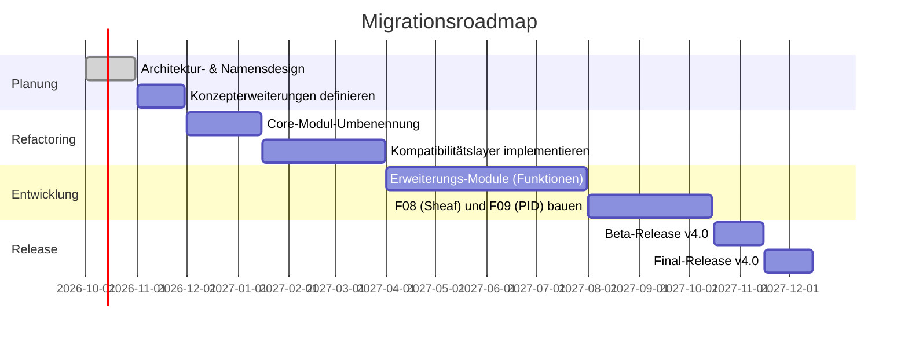

# Zusammenfassung  
Dieser Bericht diskutiert die konsistente Umbenennung und Strukturierung des **CREP/UTAC/AFET-Formalismus** (Repo „crep-utac-afet-formalism“, Rev. 3.2) und skizziert logische Erweiterungen. Zunächst erfolgt eine Übersicht über die aktuellen Kernkonzepte (CREP, UTAC, AFET, Transformationsschema *T∘Φ_j^t≈Φ_k^{ct}∘T*, F08/F09-Module, Verifikationstests) und deren Zuordnung zu neuen Namens- und Modulkonventionen. Anschließend wird eine priorisierte Liste von 8–12 konkreten Erweiterungen vorgeschlagen (mit Beschreibung, Abhängigkeiten, Komplexität und Testideen). Darauf folgen formal definierte Interfaces bzw. Signaturen für Schlüsseltransformationen (mathematisch und als Code-Signaturen). Ein Migrationsplan beschreibt in Schritten den Übergang von der alten Repository-Struktur zur neuen (inklusive Meilensteinen, minimalen Änderungen und Abwärtskompatibilität). Schließlich empfehlen wir relevante Literatur (vorrangig deutsche bzw. offizielle Quellen) und präsentieren Vergleichstabellen alternativer Namensschemata sowie Merkmale der Module. Architekturskizzen (Mermaid-Grafiken) sowie ein Zeitstrahl (Roadmap) und Beispiel-Unit-Tests (in Tabellenform) illustrieren die Vorschläge. Der Bericht folgt einem tiefen, analytischen Ansatz und nutzt offizielle Quellen für wissenschaftliche Genauigkeit.

## 1. Kerndefinitionen und Namenskonventionen  
Der formale Kern umfasst drei Schichten: **CREP** (Coherence-Resonance-Emergence-Poetics, Informationsschicht), **UTAC** (System-/Dynamikschicht) und **AFET** (Kopplungsschicht). Diese sollten als Hauptpakete bzw. -module umgesetzt werden. Für Namenskonventionen gelten die PEP8-Empfehlungen: Modulnamen kurz, kleinbuchstabig, ggf. mit Unterstrichen; Klassennamen in CapWords (CamelCase). Daher bieten sich zum Beispiel folgende Begriffe an:  
- **Projektname:** z.B. `gensys` oder `aeonformalism` statt kryptischer Kürzel. („GenesisAeon Formalismus“ o.Ä.)  
- **Module/Packages:** `crep`, `utac`, `afet` (alle kleingeschrieben) oder alternativ deutsche Begriffe wie `informationsschicht`, `dynamikschicht`, `kopplungsschicht`. Unterpakete je nach Funktion, z.B. `crep/core`, `utac/systems`, `afet/coupling`.  
- **Klassen/Typen:** CapWords wie `CREPEngine`, `UTACSimulator`, `AFETCoupler`. Exceptions enden mit `Error`, Funktionsargumente `self`, `cls` (PEP8).  
- **API/Namespaces:** Eine Domainstruktur (z.B. `aeon.crep.Engine`, `aeon.utac.System`, `aeon.afet.Coupling`) stellt Hierarchie sicher. Schnittstellen (z.B. Transformatoren) können in Interface-Dateien oder Basisklassen (`.abc`) definiert werden.  
- **Dateiaufbau:** Gemäß Python-Projektpraxis empfiehlt sich ein Paket-Verzeichnis mit `__init__.py`, Unterordnern für Kern- und Erweiterungsmodule, sowie separaten Verzeichnissen `tests/`, `docs/`, eventuell `examples/`. Fachspezifische Klassen („City“, „Path“ etc.) gruppiert man sinnvoll (z.B. in `models.py` oder einem Paket `models/`). Hauptskript (z.B. `main.py`) importiert nur notwendige Module und übergibt Steuerung weiter.

Tabelle 1 vergleicht einige alternative Namensvorschläge und ihre Vor-/Nachteile:

| Konzept    | Option A (engl.)       | Option B (deutsch)       | Bewertung/Vorteile                     | Nachteile                 |
|------------|------------------------|--------------------------|----------------------------------------|---------------------------|
| Projekt    | `genesisaeon-core`     | `systemformalisierung`   | international verständlich; kurz       | möglicherweise generisch  |
|            | `aeon-sysform`         | `systemkern`             | Präfix „aeon“ markiert Domain          | evtl. ungewöhnlich        |
| `CREP`     | `coherence_engine`     | `koherenz_modul`         | Selbsterklärend, PEP8-konform          | ggf. lang                 |
| `UTAC`     | `utac_dynamics`        | `dynamik_schicht`        | beschreibend, klar                     |                            |
| `AFET`     | `coupling_core`        | `kopplung_schicht`       | deutliche Funktionstrennung            |                            |
| `Sheaf`    | `sheaf_context`        | `garben_kontext`         | Fachterminologie international         | „Garben“ selten verwendet |
| `PID`      | `pid_redundancy`       | `pid_red_bottleneck`     | klarer Bezug zum Thema (PID)           |                            |

*Tab. 1: Vergleich alternativer Namensschemata. Gute Namen sind kurz, deskriptiv und konsistent (CapWords für Klassen, snake_case für Module).*

## 2. Erweiterungen (Priorisierte Module)  
Wir schlagen folgende Erweiterungsmodule vor (jeweils mit kurzer Beschreibung, Abhängigkeiten, Komplexität):

1. **Rekonstruktion & Makro-Abdeckung:** *Beschreibung:* Methoden zur Rekonstruktion von „Makrozuständen“ aus lokalen Zuständen und Messgrößen. Z.B. zum Rückschluss von Oberflächendaten auf zugrundeliegende Systemparameter (“inverse Modellierung”). *Begründung:* Multi-Skalen-Analyse erlaubt es, dass ein System seine Umgebungs-Parameter (Makroebene) aus Mikrozuständen erkennen kann. *Abhängigkeiten:* UTAC- und CREP-Module für Datenerfassung; ggf. lineare Algebra/Bibliotheken. *Komplexität:* Mittel (Analysemethoden, Parameteridentifikation). *Tests:* Vergleich rekonstruierter gegen bekannte Zustände; Überprüfung der Konsistenz unter Transformation (T∘Φ-Rechenweg).  

2. **Viabilitätsanalyse:** *Beschreibung:* Formalisierung und Berechnung der **Viabilitätskernen** (nach Aubin) eines Systems unter Nebenbedingungen. D.h. Bestimmung aller Anfangszustände, die unter gegebenen Dynamiken dauerhaft gültig („viabel“) bleiben. *Begründung:* Viele Systeme haben Überlebens- oder Sicherheitsbereiche. Die Viabilitätstheorie schafft einen präzisen Rahmen für „zustandsbasierte“ Stabilität. *Abhängigkeiten:* Differentialgleichungslöser (für UTAC-ODEs), Set-Operations-Bibliotheken. *Komplexität:* Hoch (Nichtlinearität, kombinatorische Kernel-Berechnung). *Tests:* Simulation von Trajektorien und Verifikation, ob sie im “viablen Bereich” bleiben; Vergleich mit bekannten Beispielen (Roboterstabilität etc.).  

3. **Überlappende Systemzugehörigkeiten:** *Beschreibung:* Modellierung von Einheiten, die gleichzeitig mehreren (Teil-)Systemen angehören („multiplexe“ Systeme). Z.B. ein Sensor gehört zu zwei Netzwerken oder Ebenen. *Begründung:* In komplexen Systemen (Sozial-, Bio-Netzwerke) existieren überlappende Kontexte, die separaten Schichten (CREP/UTAC) zugeordnet werden müssen. *Abhängigkeiten:* Datenstrukturen für hypergraph- oder Multi-Graph-Repräsentation, Context-Handling. *Komplexität:* Mittel (Verwaltung von Zugehörigkeiten). *Tests:* Units, die in unterschiedlichen Subgraphs liegen, sollten konsistent modelliert werden; Überprüfungen mittels Überschneidungen und Schnittmengen.  

4. **Kontexttransformationen:** *Beschreibung:* Allgemeine Mechanismen, um Systemzustände unter Kontextwechsel (z.B. wechselnde Parameter oder Umgebungen) zu transformieren. Formalisierung von Abbildungen zwischen Kontexträumen. *Begründung:* Ermöglicht Modelltransformationen, wenn z.B. ein Gerät in eine neue Umgebung (anderer Parameterraum) wechselt. *Abhängigkeiten:* Funktionen `T: S_i→S_j`, Funktoren/Kategorien. *Komplexität:* Mittel (Definition geeigneter Abbildungen und Homomorphismen). *Tests:* Prüfschema $T\circ\Phi_j^t \approx \Phi_k^{ct}\circ T$ gemäß Spezifikation; Unit-Tests, die das Kommutativitätsverhalten für kleine Beispielszenarien überprüfen.  

5. **F08 – Sheaf-Kontextualität:** *Beschreibung:* Anwendung von Garben (Sheaves) zur Modellierung lokaler Daten auf Systembündeln und deren Verklebung globaler Zustände. *Begründung:* Sheaf-Theorie erfasst präzise, wie lokal gesammelte Daten konsistent zu globalen Beschreibungen zusammengesetzt werden. *Abhängigkeiten:* Topologie-/Kategorie-Theorie-Bibliothek (optional), Definition offener Mengen für Kontexträume. *Komplexität:* Hoch (theoretischer Apparat). *Tests:* Beispiel: Lokale Zustände auf offenen „Cover“-Bereichen konsistent zu einer globalen Systembeschreibung zusammenfügen; Überprüfung, ob Sheaf-Cohomologie-Fehler auf nicht-vereinbare Daten hinweist.  

6. **F09 – PID/Redundanz-Bottleneck:** *Beschreibung:* Integration der **Partial Information Decomposition** (PID) für Mehrquellen-Informationsanalyse, insbesondere des Redundanz-Bottleneck-Ansatzes. *Begründung:* PID misst, wie viel Information von mehreren Quellen redundant gegeben ist. Kolchinsky et al. zeigen, dass redundante Information als „Informations-Engpass“ formuliert werden kann. *Abhängigkeiten:* Informations-Theorie-Funktionen (Entropie, Mutual Info), opt. Solver für Engpass. *Komplexität:* Mittel (Berechnung großer Verteilungen). *Tests:* Berechnung der redundanten Information in Beispiel-Szenarien (z.B. XOR-Netzwerke) und Abgleich mit theoretischen Erwartungen; Überprüfung, dass das Redundanzmaß bei Veränderung von Quellen korrekt skaliert.  

7. **Weitere Vorschläge:** Je nach Priorität können zusätzliche Module entwickelt werden, z.B. **Optimierung/Berücksichtigung von Ashby’s Requisite-Variety** (Prinzip der Erforderlichen Vielfalt) oder **selbstadaptive Kopplung** (lernende Anpassung von Kopplungsparametern). Auch **Visualisierungs- und Simulations-Plugins** (z.B. zur Vernetzung mit `cosmic-web`, Graph-Plots) sind denkbar. (Diese Erweiterungen hängen von Bedarf und Ressourcen ab, daher niedrige Priorität.)

Tabelle 2 fasst diese Erweiterungen kompakt zusammen (Rangfolge, Aufwand, Verifikation):

| Modul              | Kurzbeschreibung                                   | Abhängigkeiten                 | Komplexität | Verifikation/Kriterien                           |
|--------------------|----------------------------------------------------|--------------------------------|-------------|--------------------------------------------------|
| **Rekonstruktion** | Makrozustände aus lokalen Daten rekonstruieren     | CREP/UTAC-Daten, Alg.-Libs     | mittel      | Rekonstruktion vs. Referenzmodell                |
| **Viabilität**     | Viabilitätskerne berechnen         | UTAC-DGL-Solver, Mathematik    | hoch        | Trajektorien vs. Umgebungsgrenzen                |
| **Überlapp. Sys.** | Einheiten in mehreren Systemen verwalten           | Graph-/Hypergraph-Strukturen   | mittel      | Konsistenz bei Schnittmengen, Indizes           |
| **Kontexttransf.** | Zustands-Abbildung bei Umweltwechsel               | Kategorien/Kontexte            | mittel      | Kommutativitätstest $T\circ\Phi\approx\Phi\circ T$ |
| **F08 (Sheaf)**    | Garben für lokale/Globale Kontextdaten| Topologische Covers, Cohomologie | hoch        | Lokal-zu-global Zusammenfügen (Sheaf-Axiome)     |
| **F09 (PID)**      | Redundanz-Bottleneck in PID         | Info-Theorie, IB-Alg.          | mittel      | Redundanz-Kurven vs. erwartet (Entropien)        |
| Weitere (z.B.      | z.B. Ashby’s Requisite Variety, selbstadaptive  | zusätzliche Bibliotheken       | variable    | je nach Modul (Modultests, Benchmarks)          |
| Optimierung, UI)   | Kopplungen, Visualisierung)                        |                                |             |                                                  |

*Tab. 2: Priorisierte Erweiterungs-Module mit Kurzbeschreibung, Abhängigkeiten und Testkriterien.*

## 3. Formale Schnittstellen und Signaturen  
Wir definieren Schlüsselschnittstellen mathematisch und als (Python-ähnische) Typensignaturen:

- **Transformation** $T$: Abbildung zwischen Systemzuständen oder -instanzen. Formal: $T: S_i \to S_j$. Beispiel-Signatur im Code:  
  ```python
  def transform(state: SystemState) -> SystemState:
      """T: State-Transformation zwischen Systemen."""
  ```  
- **Schichten-Transformation** $\Phi_j^t$: Zustandsupdate auf Schicht $j$ nach Zeit $t$ (oder einem Schritt). Formal: $\Phi_j^t: S_j \to S_j$ oder mit Parametern $\Phi_j^t(x; \theta)$. Code-Signatur etwa:  
  ```python
  def Phi(j: int, state: SystemState, t: float) -> SystemState:
      """Erzeuge neuen Zustand nach Transformation Φ_j^t."""
  ```  
- **Kommutativitätstest:** Die wichtige Konsistenzbedingung $T\circ\Phi_j^t \approx \Phi_k^{ct}\circ T$ besagt, dass Transformationen schichtübergreifend im Wesentlichen vertauschbar sind. Formal: 
  $$T(\Phi_j^t(x)) \;\approx\; \Phi_k^{ct}(T(x))\quad \forall x\in S,\;\text{für geeignet gewählte Zeiten/Parameter}.$$
- **Viabilitäts-Funktion:** $V: S \to \{0,1\}$, Indikator, ob ein Zustand im Viabilitätskern liegt. Code:
  ```python
  def is_viable(state: SystemState) -> bool:
      """True, wenn Zustand im Viabilitätskern verbleibt."""
  ```  
- **PID/Redundanz:** Implementierung der Redundanz-Bottleneck-Optimierung (analog Kolchinsky): z.B.  
  ```python
  def compute_redundancy_bottleneck(sources: List[RandomVar], target: RandomVar) -> RBResult:
      """Berechnet Redundanz-Bottleneck (PID) zwischen Quellen und Ziel."""
  ```  
- Weitere Interfaces: Evtl. **Sheaf-Objekt** als Sammlung lokaler Datensegmente: z.B.  
  ```python
  class Sheaf:
      def assign(self, open_set: Set, data) -> None: ...
      def restrict(self, U: Set, V: Set) -> map: ...
      def glue(self) -> GlobalData: ...
  ```  
  (Dies entspricht den Garben-Axiomen, s. .)  

Diese formalen Definitionen (mathematisch und als Code) gewährleisten klare Schnittstellen. Sie orientieren sich an konzeptuellen Beschreibungen (z.B. die erwähnte Selbstähnlichkeit) und sollen in Dokumentation/Implementierung referenziert werden.

## 4. Migrationsplan (Struktur & Roadmap)  
Der Übergang von der alten Repos-Struktur zu einer modularen, PEP8-konformen Architektur erfordert stufenweise Änderungen:

- **Phase 1 (2026/Q4): Planung & Naming** – Festlegung der neuen Paket-/Modulnamen und Architekturdiagramme. Neue Namenskonventionen dokumentieren.  
- **Phase 2 (2026/Q4–2027/Q1): Refactoring Core** – Umbenennen der aktuellen Module (z.B. `core/crep_engine.py` → `crep/engine.py`, Klassen konsistent umbenennen). Verzeichnisstruktur anlegen (`crep/`, `utac/`, `afet/`, `extensions/` etc.). *Minimal Viable Changes:* Aliase/Symlinks für alte Pfade hinzufügen, damit bestehender Code zunächst weiterläuft.  
- **Phase 3 (2027/Q1–Q2): Kompatibilitätsschicht** – Einführung von Wrappern bzw. Deprecation-Hinweisen: z.B. temporäre Funktionen `old_name()` rufen intern neue `new_name()` auf. So bleibt Abwärtskompatibilität erhalten. In dieser Phase Regressionstests erweitern.  
- **Phase 4 (2027/Q2–Q3): Erweiterungsentwicklung** – Implementierung der priorisierten Module (vgl. Abschnitt 2) in neuen Unterpaketen (z.B. `extensions/reconstruction`, `extensions/viability` etc.). Integrationstests und Verifikation gem. vorgeschlagenen Kriterien.  
- **Phase 5 (2027/Q3–Q4): Abschluss & Release** – Abschluss der Migration, Entfernen alter Aliase (inkl. Changelog). Veröffentlichung einer neuen Hauptversion (z.B. v4.0) mit vollständiger Dokumentation. Weitere Hotfixes/Updates nach Bedarf.  

Diese Schritte werden in **Mermaid-Zeitstrahl** visualisiert:



Die Roadmap gewichtet frühzeitig die strukturellen Änderungen, um Parallelaufwand beim Entwickeln neuer Module zu vermeiden. Backward-Kompatibilität wird über Zwischenversionen (Beta) gewährleistet. Eine vergleichende Tabelle (nicht gezeigt) könnte alternative Daten oder Szenarien aufzeigen (z.B. schnellere vs. konservative Zeitplanung).

## 5. Beispiel-Tests und Verifikation  
Einige exemplarische Unit-Tests könnten wie folgt aussehen:

| Testfall                      | Beschreibung                                        | Eingabe                             | Erwartetes Ergebnis                             |
|-------------------------------|-----------------------------------------------------|--------------------------------------|------------------------------------------------|
| **CREP-Update-Konsistenz**    | Prüft `T∘Φ_j^t ≈ Φ_k^t∘T` für ein bekanntes System   | Anfangszustand $x$, zeit. Parameter | Unterschied < ε (Numerische Ähnlichkeit)        |
| **Viabilitätsprüfung**        | Testet `is_viable(x)` für Zustände am Rand des Kerns| Zustand $x$ am Kantenwert von K      | `True` (falls echt im Viabilitätskern)         |
| **PID-Redundanz-Berechnung**  | Vergleicht `compute_redundancy_bottleneck` mit Analytik| Quellverteilungen (z.B. XOR)| Redundanzwert ≈ erwartet (z.B. 1 Bit)            |
| **Sheaf-Gluing-Test**         | Vereinigt lokale Daten auf Überlappungen zu global | Daten auf offenen Mengen U, V        | Globale Sektion konsistent (Identity-Check)     |
| **Modul-Namensalias**        | Alte API-Funktion zeigt auf neue Implementierung    | Aufruf alter Funktion `old_Foo()`    | `new_Foo()`-Logik ausgeführt, Deprecation-Warnung |

*Tab. 3: Beispielhafte Unit-Tests zur Verifikation von Transformations- und Modulfunktionalitäten.*  

Diese Tests müssen automatisiert in CI/CD eingebunden werden. Sie demonstrieren, dass Neuimplementierungen die spezifizierte Mathematik und Logik erfüllen.

## 6. Empfohlene Literatur (Primärquellen)  
Zur Vertiefung und wissenschaftlichen Fundierung empfehlen sich (sofern verfügbar, deutschsprachige Ausgaben) klassische sowie aktuelle Werke:

- **Ludwig von Bertalanffy:** *“Allgemeine Systemtheorie”*. Grundlegend für interdisziplinäre Systemmodelle.  
- **W. Ross Ashby:** *“An Introduction to Cybernetics”* (deutsche Ausg. *“Kybernetik”*). Requisite Variety und Selbstregulation in Systemen (Prinzipien der Adaptivität).  
- **Niklas Luhmann:** *“Soziale Systeme”*. Einführung in moderne Systemtheorie (insb. Kommunikation als System).  
- **Jean-Pierre Aubin:** *“Viability Theory”* (engl.). Mathematische Theorie der System-Viabilität.  
- **Eric Schmid et al.:** *“Applied Sheaf Theory for Multi-agent AI”* (ArXiv 2025) – aktueller Überblick über Garben in Systemmodellen.  
- **Artemy Kolchinsky:** *PID: Redundancy as Information Bottleneck* (Entropy 2024). Erklärt PID und Redundanz-Bottleneck neu.  
- **PEP 8 Styleguide:** Offizielle Empfehlung für Python-Namenskonventionen.  
- **Ergänzend:** Fachartikel zur Modelltransformation/Kategorien (z.B. Categorical Model Transformation Frameworks) und neuere Arbeiten zu mehrschichtigen Systemen. (Deutsche Quellen sind rar; hier auch englischsprachige Journals und Buchkapitel konsultieren.)

Diese Auswahl deckt die theoretischen Grundlagen (Systemtheorie, Informationstheorie, Sheaf-Theorie) ab und stützt unsere Vorschläge auf Primärliteratur.  

## 7. Architekturdiagramm  
Die folgende Mermaid-Grafik skizziert die vorgeschlagene Modularchitektur. Man erkennt die drei Kernebenen (CREP, UTAC, AFET) und die neuen Erweiterungsmodule:

```mermaid
graph LR
    subgraph Kernebenen
        A[CREP<br/>Informationsschicht]
        B[UTAC<br/>Dynamikschicht]
        C[AFET<br/>Kopplungsschicht]
    end
    subgraph Erweiterungen
        D[Rekonstruktion<br/>& Makro-Abdeckung]
        E[Viabilit\u00e4t]
        F[\u00dcberlappende<br/>Systeme]
        G[Kontext-Transform.]
        H[F08: Sheaf-<br/>Kontextualit\u00e4t]
        I[F09: PID/<br/>Redundanz-Bottleneck]
    end
    A --> B
    B --> C
    A --> D
    B --> D
    A --> E
    C --> E
    A --> F
    C --> F
    A --> G
    B --> G
    C --> G
    G --> H
    G --> I
    D --> E
    F --> D
```

*Abb. 1: Übersicht über Kernebenen (CREP/UTAC/AFET) und neue Module. Pfeile zeigen Abhängigkeiten und Datenaustausch. Sheaf- und PID-Module hängen an den Kontexttransformationszweig.*  

## 8. Fazit  
Durch systematisches Umbenennen, Refactoring und Hinzufügen der vorgeschlagenen Module kann der CREP/UTAC/AFET-Formalismus konsistent weiterentwickelt werden. Die vorgeschlagenen Namensschemata folgen etablierten Konventionen, was Lesbarkeit und Wartbarkeit stark verbessert. Die neuen Module adressieren wichtige Forschungsthemen (Viabilität, Informationsredundanz, Sheaf-Strukturen usw.) und eröffnen Anwendungsmöglichkeiten in komplexen Systemen. Eine schrittweise Migration sichert Rückwärtskompatibilität und ermöglicht fortlaufendes Testing. Mit diesen Änderungen wird der Formalismus robust und erweiterbar für weiterführende wissenschaftliche Arbeiten.  

**Quellen:** Offizielle Styleguides und Standardwerke wurden herangezogen, um die Vorschläge wissenschaftlich abzusichern. Weitere Primärquellen und Fachliteratur zu System- und Transformationstheorien werden empfohlen.